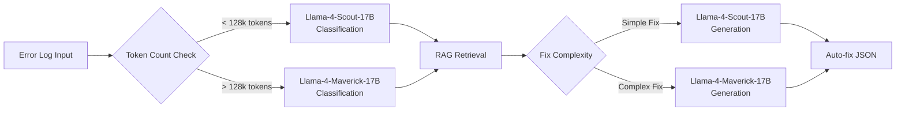

# Llama API Integration and Cost Optimization

## Overview

Quest Dev Copilot leverages Llama API's powerful models for intelligent error classification and fix generation. This document details the integration architecture, model selection strategy, and comprehensive cost optimization techniques to maximize value while minimizing expenses.

## Model Selection Strategy

### Two-Tier Architecture



### Model Specifications

#### Llama-4-Scout-17B-16E-Instruct-FP8
**Use Cases:**
- Error classification (< 128k tokens)
- Simple fix generation
- Quick validation tasks

**Characteristics:**
- **Context Window**: 128k tokens
- **Cost**: ~$0.002 per 1k tokens (estimated)
- **Latency**: Fast (< 2 seconds typical)
- **Quality**: High for focused tasks

#### Llama-4-Maverick-17B-128E-Instruct-FP8
**Use Cases:**
- Large log analysis (> 128k tokens)
- Complex multi-step fix generation
- Advanced reasoning tasks

**Characteristics:**
- **Context Window**: 128k+ tokens
- **Cost**: ~$0.004 per 1k tokens (estimated)
- **Latency**: Moderate (2-5 seconds)
- **Quality**: Exceptional for complex reasoning

## Core Implementation

### Client Architecture

```python
from llama_api_client import LlamaAPIClient
import json
import time
import asyncio
from typing import Dict, List, Optional, Union
from dataclasses import dataclass
from enum import Enum

class ModelType(Enum):
    SCOUT = "Llama-4-Scout-17B-16E-Instruct-FP8"
    MAVERICK = "Llama-4-Maverick-17B-128E-Instruct-FP8"

@dataclass
class TokenUsage:
    input_tokens: int
    output_tokens: int
    total_tokens: int
    estimated_cost: float
    latency_ms: int

@dataclass
class LlamaResponse:
    content: str
    usage: TokenUsage
    model_used: ModelType
    completion_reason: str

class QuestCopilotLlama:
    def __init__(self, api_key: str):
        self.client = LlamaAPIClient(api_key=api_key)
        self.scout_token_limit = 128000
        self.cost_per_1k_tokens = {
            ModelType.SCOUT: 0.002,
            ModelType.MAVERICK: 0.004
        }
        
        # Cost tracking
        self.daily_usage = 0.0
        self.request_count = 0
        self.token_count = 0
        
        # Performance metrics
        self.response_times = []
        self.error_rates = []
```

### Smart Model Selection

```python
def select_optimal_model(self, prompt: str, task_type: str, 
                        context_docs: List[str] = None) -> ModelType:
    """
    Intelligently select the best model based on:
    - Token count estimation
    - Task complexity
    - Cost constraints
    - Quality requirements
    """
    
    # Estimate total tokens
    estimated_tokens = self._estimate_tokens(prompt, context_docs)
    
    # Task complexity analysis
    complexity_score = self._analyze_task_complexity(prompt, task_type)
    
    # Cost consideration
    budget_remaining = self._get_remaining_budget()
    
    # Decision logic
    if task_type == "classification":
        # Classification is usually simpler and faster
        if estimated_tokens < self.scout_token_limit:
            return ModelType.SCOUT
        else:
            return ModelType.MAVERICK
    
    elif task_type == "fix_generation":
        # Fix generation requires more reasoning
        if complexity_score < 0.5 and estimated_tokens < self.scout_token_limit:
            # Simple fix, use Scout for cost efficiency
            return ModelType.SCOUT
        else:
            # Complex fix or large context, use Maverick
            return ModelType.MAVERICK
    
    # Default to Scout for unknown tasks
    return ModelType.SCOUT

def _estimate_tokens(self, prompt: str, context_docs: List[str] = None) -> int:
    """Estimate token count for model selection"""
    
    # Base prompt tokens (rough estimation: 1.3 tokens per word)
    base_tokens = len(prompt.split()) * 1.3
    
    # Context documents tokens
    context_tokens = 0
    if context_docs:
        for doc in context_docs:
            context_tokens += len(doc.split()) * 1.3
    
    # Add buffer for response tokens (estimated max output)
    response_buffer = 2048  # Max expected response
    
    total_estimated = int(base_tokens + context_tokens + response_buffer)
    
    return total_estimated

def _analyze_task_complexity(self, prompt: str, task_type: str) -> float:
    """Analyze task complexity to inform model selection"""
    
    complexity_indicators = {
        'multi_step': ['step 1', 'step 2', 'first', 'then', 'next', 'finally'],
        'configuration': ['config', '.ini', '.uproject', 'settings', 'parameter'],
        'code_generation': ['create', 'write', 'implement', 'generate', 'build'],
        'debugging': ['trace', 'debug', 'analyze', 'investigate', 'diagnose'],
        'integration': ['integrate', 'connect', 'combine', 'merge', 'link']
    }
    
    prompt_lower = prompt.lower()
    complexity_score = 0.0
    
    for category, indicators in complexity_indicators.items():
        matches = sum(1 for indicator in indicators if indicator in prompt_lower)
        category_score = min(matches * 0.1, 0.3)  # Max 0.3 per category
        complexity_score += category_score
    
    # Normalize to 0-1 range
    return min(complexity_score, 1.0)
```

### Error Classification Implementation

```python
async def classify_error(self, log_content: str) -> Dict:
    """
    Classify error type with structured output and confidence scoring
    """
    
    # Select appropriate model
    model = self.select_optimal_model(log_content, "classification")
    
    # Prepare structured prompt
    system_prompt = """You are an expert Unreal Engine developer specializing in Quest VR builds.
Analyze the provided log and classify the error type with high precision.

Focus on these specific error categories:
1. plugin_conflict - OpenXR vs MetaXR plugin conflicts
2. sdk_mismatch - Android SDK version compatibility issues (32 vs 33/34)
3. black_screen - Runtime rendering and display issues
4. other - Any other build/runtime errors

Provide confidence scores based on the clarity and specificity of error indicators."""

    user_prompt = f"""Analyze this Unreal Engine Quest build log and classify the error:

LOG CONTENT:
{log_content[:3000]}  # Limit for classification

Respond with JSON matching this exact schema:
{{
    "error_type": "plugin_conflict|sdk_mismatch|black_screen|other",
    "confidence": 0.0-1.0,
    "key_indicators": ["indicator1", "indicator2", "indicator3"],
    "auto_fixable": true|false,
    "reasoning": "Brief explanation of classification",
    "severity": "low|medium|high|critical"
}}"""

    try:
        start_time = time.time()
        
        response = await self.client.chat.completions.create(
            model=model.value,
            messages=[
                {"role": "system", "content": system_prompt},
                {"role": "user", "content": user_prompt}
            ],
            temperature=0.2,  # Low temperature for consistent classification
            max_completion_tokens=1000,
            response_format={
                "type": "json_schema",
                "json_schema": {
                    "name": "ErrorClassification",
                    "schema": {
                        "type": "object",
                        "properties": {
                            "error_type": {
                                "type": "string",
                                "enum": ["plugin_conflict", "sdk_mismatch", "black_screen", "other"]
                            },
                            "confidence": {"type": "number", "minimum": 0, "maximum": 1},
                            "key_indicators": {"type": "array", "items": {"type": "string"}},
                            "auto_fixable": {"type": "boolean"},
                            "reasoning": {"type": "string"},
                            "severity": {
                                "type": "string", 
                                "enum": ["low", "medium", "high", "critical"]
                            }
                        },
                        "required": ["error_type", "confidence", "key_indicators", "auto_fixable"]
                    }
                }
            }
        )
        
        # Track usage
        usage = self._extract_usage_metrics(response, start_time, model)
        self._update_usage_tracking(usage)
        
        # Parse and validate response
        classification = json.loads(response.completion_message.content.text)
        
        # Add usage metadata
        classification['_metadata'] = {
            'model_used': model.value,
            'tokens_used': usage.total_tokens,
            'cost': usage.estimated_cost,
            'latency_ms': usage.latency_ms
        }
        
        return classification
        
    except Exception as e:
        logger.error(f"Error classification failed: {e}")
        
        # Return fallback classification
        return {
            "error_type": "other",
            "confidence": 0.1,
            "key_indicators": ["classification_failed"],
            "auto_fixable": False,
            "reasoning": f"Classification failed: {str(e)}",
            "severity": "medium",
            "_metadata": {
                "model_used": "fallback",
                "tokens_used": 0,
                "cost": 0.0,
                "latency_ms": 0
            }
        }
```

### Fix Generation Implementation

```python
async def generate_fix(self, error_type: str, relevant_docs: List[str], 
                      full_log: str, screenshot_base64: Optional[str] = None) -> Dict:
    """
    Generate comprehensive fix instructions with auto-fix capabilities
    """
    
    # Prepare context from RAG retrieval
    context_text = self._prepare_context(relevant_docs)
    
    # Select model based on complexity
    total_content = context_text + full_log
    model = self.select_optimal_model(total_content, "fix_generation", relevant_docs)
    
    # Build comprehensive prompt
    system_prompt = f"""You are an expert Unreal Engine developer with deep expertise in Quest VR development.
Generate precise, actionable fixes for {error_type} errors.

Requirements:
1. Provide step-by-step instructions with exact file paths
2. Include specific settings and configuration values
3. Generate auto-fix JSON when possible
4. Cite source documentation
5. Explain the root cause
6. Provide verification steps

Auto-fix capabilities:
- Plugin toggles (.uproject modifications)
- Config file updates (DefaultEngine.ini)
- Project setting changes

Always prioritize user safety - never suggest destructive operations without clear warnings."""

    user_prompt = self._build_fix_prompt(error_type, context_text, full_log, screenshot_base64)
    
    try:
        start_time = time.time()
        
        # Build messages with optional multimodal content
        messages = [
            {"role": "system", "content": system_prompt},
            {"role": "user", "content": user_prompt}
        ]
        
        # Add screenshot if provided (multimodal)
        if screenshot_base64:
            messages[1]["content"] = [
                {"type": "text", "text": user_prompt},
                {
                    "type": "image_url", 
                    "image_url": {"url": f"data:image/jpeg;base64,{screenshot_base64}"}
                }
            ]
        
        response = await self.client.chat.completions.create(
            model=model.value,
            messages=messages,
            temperature=0.3,  # Slightly higher for creative problem-solving
            max_completion_tokens=2048
        )
        
        # Extract and track usage
        usage = self._extract_usage_metrics(response, start_time, model)
        self._update_usage_tracking(usage)
        
        # Parse response
        fix_content = response.completion_message.content.text
        
        # Extract auto-fix JSON if present
        auto_fix_json = self._extract_auto_fix_json(fix_content, error_type)
        
        return {
            "fix_instructions": fix_content,
            "auto_fix": auto_fix_json,
            "model_used": model.value,
            "metadata": {
                "tokens_used": usage.total_tokens,
                "estimated_cost": usage.estimated_cost,
                "latency_ms": usage.latency_ms,
                "context_docs_count": len(relevant_docs),
                "log_size_chars": len(full_log)
            }
        }
        
    except Exception as e:
        logger.error(f"Fix generation failed: {e}")
        return self._generate_fallback_fix(error_type, e)

def _build_fix_prompt(self, error_type: str, context_text: str, 
                     full_log: str, screenshot_base64: Optional[str]) -> str:
    """Build comprehensive fix generation prompt"""
    
    prompt_parts = [
        f"ERROR TYPE: {error_type}",
        "",
        "RETRIEVED DOCUMENTATION:",
        context_text,
        "",
        "FULL ERROR LOG:",
        full_log[-8000:],  # Last 8k chars to stay within limits
        "",
        "REQUIREMENTS:",
        "1. Provide step-by-step fix instructions",
        "2. Include exact file paths and configuration values",
        "3. Generate auto-fix JSON if the fix can be automated",
        "4. Cite relevant sources from the documentation",
        "5. Explain why this fix works"
    ]
    
    if screenshot_base64:
        prompt_parts.extend([
            "",
            "VISUAL CONTEXT:",
            "A screenshot has been provided showing the current state of the issue."
        ])
    
    prompt_parts.extend([
        "",
        "AUTO-FIX FORMAT (if applicable):",
        "Include JSON like this for automatable fixes:",
        '{"action": "toggle_plugin", "plugin_name": "OpenXR", "enabled": false}',
        'OR',
        '{"action": "update_config", "file_path": "Config/DefaultEngine.ini", '
        '"section": "[/Script/AndroidRuntimeSettings.AndroidRuntimeSettings]", '
        '"key": "TargetSDKVersion", "value": "32"}'
    ])
    
    return "\n".join(prompt_parts)

def _extract_auto_fix_json(self, fix_text: str, error_type: str) -> Optional[Dict]:
    """Extract auto-fix JSON from fix instructions"""
    
    # Look for JSON blocks in the response
    import re
    json_pattern = r'```json\s*(\{.*?\})\s*```'
    json_matches = re.findall(json_pattern, fix_text, re.DOTALL)
    
    for json_str in json_matches:
        try:
            auto_fix = json.loads(json_str)
            if self._validate_auto_fix(auto_fix, error_type):
                return auto_fix
        except json.JSONDecodeError:
            continue
    
    # Fallback: extract based on known patterns
    return self._extract_auto_fix_by_pattern(fix_text, error_type)

def _validate_auto_fix(self, auto_fix: Dict, error_type: str) -> bool:
    """Validate auto-fix JSON structure and safety"""
    
    required_fields = ["action"]
    if not all(field in auto_fix for field in required_fields):
        return False
    
    action = auto_fix.get("action")
    
    # Validate plugin toggle
    if action == "toggle_plugin":
        required = ["plugin_name", "enabled"]
        if not all(field in auto_fix for field in required):
            return False
        
        # Safety check: only allow known safe plugins
        safe_plugins = ["OpenXR", "MetaXR", "SteamVR", "OculusVR"]
        if auto_fix["plugin_name"] not in safe_plugins:
            return False
    
    # Validate config update
    elif action == "update_config":
        required = ["file_path", "section", "key", "value"]
        if not all(field in auto_fix for field in required):
            return False
        
        # Safety check: only allow known safe config files
        safe_files = ["Config/DefaultEngine.ini", "Config/DefaultGame.ini"]
        if not any(safe_file in auto_fix["file_path"] for safe_file in safe_files):
            return False
    
    else:
        return False  # Unknown action type
    
    return True
```

## Cost Optimization Strategies

### 1. Token Management

```python
class TokenOptimizer:
    def __init__(self, max_daily_budget: float = 50.0):
        self.max_daily_budget = max_daily_budget
        self.current_usage = 0.0
        self.token_cache = {}
        
    def optimize_prompt(self, prompt: str, context_docs: List[str]) -> str:
        """Optimize prompt to reduce token usage while maintaining quality"""
        
        # 1. Remove redundant information
        optimized_prompt = self._remove_redundancy(prompt)
        
        # 2. Compress context documents
        compressed_context = self._compress_context(context_docs)
        
        # 3. Use abbreviations for common terms
        optimized_prompt = self._apply_abbreviations(optimized_prompt)
        
        return f"{optimized_prompt}\n\nCONTEXT:\n{compressed_context}"
    
    def _compress_context(self, docs: List[str], max_context_tokens: int = 4000) -> str:
        """Intelligently compress context while preserving key information"""
        
        if not docs:
            return ""
        
        # Extract key sentences from each document
        key_sentences = []
        for doc in docs:
            sentences = doc.split('. ')
            
            # Score sentences by relevance indicators
            scored_sentences = []
            for sentence in sentences:
                score = self._score_sentence_relevance(sentence)
                if score > 0.3:  # Relevance threshold
                    scored_sentences.append((sentence, score))
            
            # Sort by relevance and take top sentences
            scored_sentences.sort(key=lambda x: x[1], reverse=True)
            key_sentences.extend([s[0] for s in scored_sentences[:3]])  # Top 3 per doc
        
        # Combine and truncate to fit token budget
        compressed = '. '.join(key_sentences)
        
        # Estimate tokens and truncate if necessary
        estimated_tokens = len(compressed.split()) * 1.3
        if estimated_tokens > max_context_tokens:
            words = compressed.split()
            target_words = int(max_context_tokens / 1.3)
            compressed = ' '.join(words[:target_words])
        
        return compressed
    
    def _score_sentence_relevance(self, sentence: str) -> float:
        """Score sentence relevance for context compression"""
        
        relevance_keywords = {
            'high': ['error', 'fix', 'solution', 'resolve', 'configure', 'setting'],
            'medium': ['plugin', 'sdk', 'android', 'quest', 'unreal', 'project'],
            'low': ['download', 'install', 'documentation', 'example']
        }
        
        sentence_lower = sentence.lower()
        score = 0.0
        
        for level, keywords in relevance_keywords.items():
            matches = sum(1 for kw in keywords if kw in sentence_lower)
            if level == 'high':
                score += matches * 0.3
            elif level == 'medium':
                score += matches * 0.2
            else:
                score += matches * 0.1
        
        # Boost for specific patterns
        if any(pattern in sentence_lower for pattern in ['step 1', 'first', 'to fix']):
            score += 0.2
        
        return min(score, 1.0)
```

### 2. Caching Strategy

```python
class ResponseCache:
    def __init__(self, cache_ttl: int = 3600):  # 1 hour TTL
        self.cache = {}
        self.cache_ttl = cache_ttl
        self.hit_count = 0
        self.miss_count = 0
    
    def get_cache_key(self, error_type: str, log_snippet: str, 
                     context_hash: str) -> str:
        """Generate cache key for similar errors"""
        
        # Extract key error indicators for grouping
        indicators = self._extract_key_indicators(log_snippet, error_type)
        
        # Create hash from error signature
        error_signature = f"{error_type}:{':'.join(sorted(indicators))}:{context_hash}"
        return hashlib.md5(error_signature.encode()).hexdigest()
    
    def _extract_key_indicators(self, log_snippet: str, error_type: str) -> List[str]:
        """Extract key error indicators for cache grouping"""
        
        patterns = {
            'plugin_conflict': [
                r'(OpenXR|MetaXR|XR.*plugin)',
                r'(multiple.*plugin|conflict)',
                r'(failed.*initialize.*XR)'
            ],
            'sdk_mismatch': [
                r'(SDK.*version.*\d+)',
                r'(Target.*SDK.*\d+)',
                r'(Android.*\d+)'
            ],
            'black_screen': [
                r'(black.*screen|blank.*display)',
                r'(render.*target|eye.*buffer)',
                r'(VR.*compositor|submit.*failed)'
            ]
        }
        
        indicators = []
        if error_type in patterns:
            for pattern in patterns[error_type]:
                matches = re.findall(pattern, log_snippet, re.IGNORECASE)
                indicators.extend(matches)
        
        return indicators[:5]  # Limit to top 5 indicators
    
    async def get_or_generate(self, cache_key: str, 
                             generation_func, *args, **kwargs) -> Dict:
        """Get cached response or generate new one"""
        
        # Check cache
        if cache_key in self.cache:
            cached_item = self.cache[cache_key]
            if time.time() - cached_item['timestamp'] < self.cache_ttl:
                self.hit_count += 1
                logger.info(f"Cache hit for key: {cache_key[:8]}...")
                return cached_item['response']
            else:
                # Expired
                del self.cache[cache_key]
        
        # Generate new response
        self.miss_count += 1
        response = await generation_func(*args, **kwargs)
        
        # Cache the response
        self.cache[cache_key] = {
            'response': response,
            'timestamp': time.time()
        }
        
        logger.info(f"Cache miss, generated new response for: {cache_key[:8]}...")
        return response
    
    def get_cache_stats(self) -> Dict:
        """Get cache performance statistics"""
        total_requests = self.hit_count + self.miss_count
        hit_rate = self.hit_count / total_requests if total_requests > 0 else 0
        
        return {
            'hit_rate': hit_rate,
            'hit_count': self.hit_count,
            'miss_count': self.miss_count,
            'cached_items': len(self.cache)
        }
```

### 3. Budget Management

```python
class BudgetManager:
    def __init__(self, daily_budget: float = 25.0, monthly_budget: float = 500.0):
        self.daily_budget = daily_budget
        self.monthly_budget = monthly_budget
        self.usage_tracker = UsageTracker()
        
    async def check_budget_before_request(self, estimated_cost: float) -> bool:
        """Check if request would exceed budget limits"""
        
        daily_usage = await self.usage_tracker.get_daily_usage()
        monthly_usage = await self.usage_tracker.get_monthly_usage()
        
        # Check daily budget
        if daily_usage + estimated_cost > self.daily_budget:
            logger.warning(f"Request would exceed daily budget: "
                          f"${daily_usage + estimated_cost:.4f} > ${self.daily_budget}")
            return False
        
        # Check monthly budget
        if monthly_usage + estimated_cost > self.monthly_budget:
            logger.warning(f"Request would exceed monthly budget: "
                          f"${monthly_usage + estimated_cost:.4f} > ${self.monthly_budget}")
            return False
        
        return True
    
    def estimate_request_cost(self, prompt: str, context_docs: List[str], 
                            model: ModelType) -> float:
        """Estimate cost of a request before sending"""
        
        # Estimate input tokens
        total_text = prompt + '\n'.join(context_docs)
        estimated_input_tokens = len(total_text.split()) * 1.3
        
        # Estimate output tokens (based on task type)
        estimated_output_tokens = 1500  # Conservative estimate
        
        total_tokens = estimated_input_tokens + estimated_output_tokens
        cost_per_1k = self.cost_per_1k_tokens[model]
        
        estimated_cost = (total_tokens / 1000) * cost_per_1k
        
        return estimated_cost
    
    async def apply_cost_based_optimizations(self, request_params: Dict) -> Dict:
        """Apply optimizations based on current budget usage"""
        
        daily_usage = await self.usage_tracker.get_daily_usage()
        budget_utilization = daily_usage / self.daily_budget
        
        optimized_params = request_params.copy()
        
        # If budget utilization is high, apply more aggressive optimizations
        if budget_utilization > 0.8:  # 80% of daily budget used
            
            # Reduce max output tokens
            optimized_params['max_completion_tokens'] = min(
                optimized_params.get('max_completion_tokens', 2048), 
                1000
            )
            
            # Prefer Scout model if possible
            if optimized_params.get('model') == ModelType.MAVERICK.value:
                # Check if Scout can handle this request
                estimated_tokens = self._estimate_tokens_from_params(optimized_params)
                if estimated_tokens < self.scout_token_limit:
                    optimized_params['model'] = ModelType.SCOUT.value
                    logger.info("Switched to Scout model for cost optimization")
            
            # Increase cache usage preference
            optimized_params['prefer_cache'] = True
        
        return optimized_params

class UsageTracker:
    def __init__(self, storage_backend='file'):  # Could be 'redis', 'database', etc.
        self.storage_backend = storage_backend
        self.usage_file = Path('data/usage_tracking.json')
        
    async def track_request(self, model: ModelType, tokens_used: int, 
                           cost: float, latency_ms: int):
        """Track individual request usage"""
        
        usage_data = await self._load_usage_data()
        
        today = datetime.now().strftime('%Y-%m-%d')
        month = datetime.now().strftime('%Y-%m')
        
        # Initialize if needed
        if today not in usage_data['daily']:
            usage_data['daily'][today] = {
                'total_cost': 0.0,
                'total_tokens': 0,
                'request_count': 0,
                'model_usage': {}
            }
        
        if month not in usage_data['monthly']:
            usage_data['monthly'][month] = {
                'total_cost': 0.0,
                'total_tokens': 0,
                'request_count': 0
            }
        
        # Update daily stats
        daily_stats = usage_data['daily'][today]
        daily_stats['total_cost'] += cost
        daily_stats['total_tokens'] += tokens_used
        daily_stats['request_count'] += 1
        
        if model.value not in daily_stats['model_usage']:
            daily_stats['model_usage'][model.value] = {
                'cost': 0.0, 'tokens': 0, 'requests': 0
            }
        
        model_stats = daily_stats['model_usage'][model.value]
        model_stats['cost'] += cost
        model_stats['tokens'] += tokens_used
        model_stats['requests'] += 1
        
        # Update monthly stats
        monthly_stats = usage_data['monthly'][month]
        monthly_stats['total_cost'] += cost
        monthly_stats['total_tokens'] += tokens_used
        monthly_stats['request_count'] += 1
        
        # Save updated data
        await self._save_usage_data(usage_data)
    
    async def get_daily_usage(self, date: str = None) -> float:
        """Get total cost for a specific day"""
        if date is None:
            date = datetime.now().strftime('%Y-%m-%d')
        
        usage_data = await self._load_usage_data()
        return usage_data['daily'].get(date, {}).get('total_cost', 0.0)
    
    async def get_usage_report(self) -> Dict:
        """Generate comprehensive usage report"""
        usage_data = await self._load_usage_data()
        today = datetime.now().strftime('%Y-%m-%d')
        month = datetime.now().strftime('%Y-%m')
        
        daily_stats = usage_data['daily'].get(today, {})
        monthly_stats = usage_data['monthly'].get(month, {})
        
        return {
            'today': {
                'cost': daily_stats.get('total_cost', 0.0),
                'tokens': daily_stats.get('total_tokens', 0),
                'requests': daily_stats.get('request_count', 0),
                'model_breakdown': daily_stats.get('model_usage', {})
            },
            'this_month': {
                'cost': monthly_stats.get('total_cost', 0.0),
                'tokens': monthly_stats.get('total_tokens', 0),
                'requests': monthly_stats.get('request_count', 0)
            }
        }
```

### 4. Performance Monitoring

```python
class PerformanceMonitor:
    def __init__(self):
        self.metrics = {
            'response_times': [],
            'token_efficiency': [],
            'error_rates': [],
            'cost_per_request': []
        }
        
    def track_request_performance(self, request_data: Dict, response_data: Dict):
        """Track performance metrics for optimization"""
        
        # Response time tracking
        latency = response_data.get('latency_ms', 0)
        self.metrics['response_times'].append(latency)
        
        # Token efficiency (output tokens / input tokens)
        input_tokens = response_data.get('input_tokens', 1)
        output_tokens = response_data.get('output_tokens', 0)
        efficiency = output_tokens / input_tokens
        self.metrics['token_efficiency'].append(efficiency)
        
        # Cost per request
        cost = response_data.get('estimated_cost', 0.0)
        self.metrics['cost_per_request'].append(cost)
        
        # Clean up old metrics (keep last 1000 requests)
        for metric_list in self.metrics.values():
            if len(metric_list) > 1000:
                metric_list.pop(0)
    
    def get_performance_insights(self) -> Dict:
        """Generate actionable performance insights"""
        
        if not self.metrics['response_times']:
            return {"status": "insufficient_data"}
        
        insights = {
            'response_time': {
                'avg_ms': np.mean(self.metrics['response_times']),
                'p95_ms': np.percentile(self.metrics['response_times'], 95),
                'trend': self._calculate_trend(self.metrics['response_times'])
            },
            'cost_efficiency': {
                'avg_cost_per_request': np.mean(self.metrics['cost_per_request']),
                'daily_projection': np.mean(self.metrics['cost_per_request']) * 24,  # Rough estimate
                'optimization_potential': self._assess_optimization_potential()
            },
            'recommendations': self._generate_recommendations()
        }
        
        return insights
    
    def _assess_optimization_potential(self) -> Dict:
        """Assess potential for cost and performance optimization"""
        
        avg_cost = np.mean(self.metrics['cost_per_request'])
        avg_efficiency = np.mean(self.metrics['token_efficiency'])
        
        potential = {
            'cost_reduction': 0.0,
            'performance_improvement': 0.0,
            'priority_actions': []
        }
        
        # High cost requests indicate potential for model downgrading
        if avg_cost > 0.05:  # $0.05 per request threshold
            potential['cost_reduction'] = 0.3  # 30% potential reduction
            potential['priority_actions'].append('Consider Scout model for more requests')
        
        # Low token efficiency indicates verbose prompts
        if avg_efficiency < 0.3:  # Less than 30% efficiency
            potential['performance_improvement'] = 0.2
            potential['priority_actions'].append('Optimize prompt compression')
        
        # High response times indicate need for caching
        avg_latency = np.mean(self.metrics['response_times'])
        if avg_latency > 4000:  # > 4 seconds
            potential['performance_improvement'] = max(potential['performance_improvement'], 0.4)
            potential['priority_actions'].append('Implement more aggressive caching')
        
        return potential
```

## Production Best Practices

### 1. Error Handling and Resilience

```python
class ResilientLlamaClient:
    def __init__(self, *args, **kwargs):
        super().__init__(*args, **kwargs)
        self.circuit_breaker = CircuitBreaker()
        self.retry_config = {
            'max_retries': 3,
            'backoff_factor': 2,
            'max_backoff': 30
        }
    
    async def safe_request(self, request_func, *args, **kwargs):
        """Make API request with circuit breaker and retry logic"""
        
        if self.circuit_breaker.is_open():
            raise CircuitBreakerException("API temporarily unavailable")
        
        for attempt in range(self.retry_config['max_retries']):
            try:
                result = await request_func(*args, **kwargs)
                self.circuit_breaker.record_success()
                return result
                
            except RateLimitError as e:
                wait_time = min(
                    self.retry_config['backoff_factor'] ** attempt,
                    self.retry_config['max_backoff']
                )
                await asyncio.sleep(wait_time)
                
            except APITimeoutError as e:
                if attempt == self.retry_config['max_retries'] - 1:
                    self.circuit_breaker.record_failure()
                    raise
                await asyncio.sleep(2 ** attempt)
                
            except APIError as e:
                self.circuit_breaker.record_failure()
                raise
        
        raise MaxRetriesExceeded("All retry attempts failed")

class CircuitBreaker:
    def __init__(self, failure_threshold=5, timeout=60):
        self.failure_threshold = failure_threshold
        self.timeout = timeout
        self.failure_count = 0
        self.last_failure_time = None
        self.state = 'closed'  # closed, open, half_open
    
    def is_open(self) -> bool:
        if self.state == 'open':
            if time.time() - self.last_failure_time > self.timeout:
                self.state = 'half_open'
                return False
            return True
        return False
    
    def record_success(self):
        self.failure_count = 0
        self.state = 'closed'
    
    def record_failure(self):
        self.failure_count += 1
        self.last_failure_time = time.time()
        
        if self.failure_count >= self.failure_threshold:
            self.state = 'open'
```

### 2. Monitoring and Alerting

```python
# Integration with monitoring systems
import structlog
from prometheus_client import Counter, Histogram, Gauge

# Metrics
llama_requests_total = Counter('llama_requests_total', 'Total Llama API requests', ['model', 'status'])
llama_request_duration = Histogram('llama_request_duration_seconds', 'Request duration', ['model'])
llama_tokens_used = Counter('llama_tokens_used_total', 'Total tokens used', ['model', 'type'])
llama_cost_total = Counter('llama_cost_usd_total', 'Total cost in USD', ['model'])
daily_budget_usage = Gauge('llama_daily_budget_usage_ratio', 'Daily budget usage ratio')

async def monitored_llama_request(self, model: ModelType, request_func, *args, **kwargs):
    """Wrapper for monitoring Llama API requests"""
    
    start_time = time.time()
    
    try:
        with llama_request_duration.labels(model=model.value).time():
            result = await request_func(*args, **kwargs)
        
        # Record success metrics
        llama_requests_total.labels(model=model.value, status='success').inc()
        
        if 'usage' in result:
            usage = result['usage']
            llama_tokens_used.labels(model=model.value, type='input').inc(usage.input_tokens)
            llama_tokens_used.labels(model=model.value, type='output').inc(usage.output_tokens)
            llama_cost_total.labels(model=model.value).inc(usage.estimated_cost)
        
        # Update budget usage gauge
        daily_usage = await self.usage_tracker.get_daily_usage()
        budget_ratio = daily_usage / self.budget_manager.daily_budget
        daily_budget_usage.set(budget_ratio)
        
        return result
        
    except Exception as e:
        llama_requests_total.labels(model=model.value, status='error').inc()
        logger.error(f"Llama API request failed", 
                    model=model.value, error=str(e), duration=time.time()-start_time)
        raise
```

This comprehensive Llama API integration provides intelligent model selection, aggressive cost optimization, and production-ready monitoring while maintaining high-quality AI-powered error analysis and fix generation for Quest development issues.