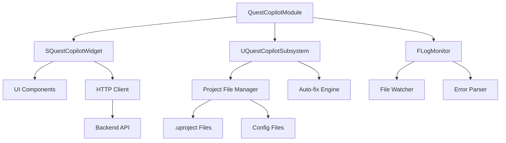

# Unreal Engine Plugin Guide

## Overview

The Quest Dev Copilot Unreal Engine plugin provides seamless integration between your development workflow and the AI-powered error analysis system. This plugin automatically detects build errors, communicates with the backend API, and can apply fixes directly within the UE Editor.

## Features

✅ **Real-time Error Detection** - Monitors log files for Quest-specific errors  
✅ **One-click Analysis** - Send error logs to AI backend for instant analysis  
✅ **Auto-fix Application** - Automatically apply safe fixes (plugin toggles, config updates)  
✅ **Visual Feedback** - Rich UI showing error classification and fix instructions  
✅ **Project Integration** - Deep integration with UE project files and settings  
✅ **Cost Tracking** - Monitor AI usage and costs directly in the editor  

## Installation

### Prerequisites

- **Unreal Engine 5.4+** (5.3 may work but not tested)
- **Quest Development Setup** (Meta XR SDK, Android SDK)
- **Backend Server Running** (see main README for setup)
- **Windows/Mac/Linux** (cross-platform support)

### Method 1: Direct Installation (Recommended)

1. **Copy Plugin Files**
   ```bash
   # Copy the entire QuestCopilot folder to your project
   cp -r QuestCopilot/ /path/to/your/project/Plugins/
   ```

2. **Regenerate Project Files**
   ```bash
   # From your project root directory
   /path/to/UnrealBuildTool/UnrealBuildTool.exe -projectfiles -project="YourProject.uproject" -game -rocket -progress
   ```

3. **Enable Plugin in Editor**
   - Open your project in UE Editor
   - Go to `Edit → Plugins`
   - Search for "Quest Dev Copilot"
   - Check the "Enabled" checkbox
   - Restart the editor when prompted

### Method 2: Marketplace Installation (Future)

Once published to the Epic Games Marketplace:
1. Open Epic Games Launcher
2. Go to Unreal Engine → Marketplace
3. Search for "Quest Dev Copilot"
4. Install to Engine or Project

## Configuration

### Plugin Settings

Access plugin settings via `Edit → Project Settings → Plugins → Quest Copilot`:

#### Backend Configuration
```ini
[QuestCopilot.Settings]
# Backend API endpoint
BackendURL=http://localhost:5000

# Connection timeout (seconds)
TimeoutSeconds=30

# Enable/disable automatic error detection
AutoDetectErrors=true

# Maximum log lines to analyze (performance)
MaxLogLines=5000
```

#### Error Detection Settings
```ini
# Which error types to monitor
MonitorPluginConflicts=true
MonitorSDKMismatches=true
MonitorBlackScreenIssues=true
MonitorOtherErrors=true

# Auto-refresh interval (seconds)
LogRefreshInterval=5

# Log file paths (advanced users only)
CustomLogPaths=
```

#### Auto-fix Settings
```ini
# Enable automatic fix application
EnableAutoFix=true

# Require confirmation before applying fixes
ConfirmBeforeAutoFix=true

# Backup files before modification
CreateBackups=true

# Safe mode (only apply verified fixes)
SafeModeOnly=true
```

### Environment Variables

Set these in your system or project environment:

```bash
# Backend configuration
QUEST_COPILOT_BACKEND_URL=http://localhost:5000
QUEST_COPILOT_API_KEY=optional_api_key_for_auth

# Debug settings
QUEST_COPILOT_DEBUG=false
QUEST_COPILOT_LOG_LEVEL=INFO
```

## User Interface

### Main Widget

The Quest Dev Copilot widget is accessible via:
- **Menu**: `Window → Developer Tools → Quest Dev Copilot`
- **Toolbar**: Click the Quest Copilot icon (🤖)
- **Shortcut**: `Ctrl+Shift+Q` (customizable)


#### UI Components

1. **Header Bar**
   - Plugin status indicator
   - Backend connection status
   - Settings button

2. **Log Preview Panel**
   - Shows last 200 lines of log
   - Syntax highlighting for errors
   - Auto-scroll to latest entries

3. **Analysis Controls**
   - "Analyze Error" button
   - Progress indicator during analysis
   - Force refresh button

4. **Results Panel**
   - Error classification with confidence
   - Step-by-step fix instructions
   - Source citations
   - Auto-fix preview

5. **Action Buttons**
   - "Apply Auto-fix" (when available)
   - "Copy Instructions"
   - "Open Log File"
   - "View Details"

### Status Indicators

```cpp
// Status colors and meanings
enum class EAnalysisStatus
{
    Ready,          // Green - Ready for analysis
    Analyzing,      // Yellow - AI processing
    Success,        // Blue - Analysis complete
    Error,          // Red - Analysis failed
    NoConnection    // Gray - Backend unavailable
};
```

## Plugin Architecture

### Core Components



### File Structure

```
QuestCopilot/
├── QuestCopilot.uplugin              # Plugin descriptor
├── Source/QuestCopilot/
│   ├── Private/
│   │   ├── QuestCopilotModule.cpp     # Main module
│   │   ├── SQuestCopilotWidget.cpp    # UI implementation
│   │   ├── QuestCopilotSubsystem.cpp  # Core functionality
│   │   ├── LogMonitor.cpp             # Log file monitoring
│   │   ├── AutoFixEngine.cpp          # Fix application
│   │   └── HttpClient.cpp             # Backend communication
│   ├── Public/
│   │   ├── QuestCopilotModule.h
│   │   ├── SQuestCopilotWidget.h
│   │   ├── QuestCopilotSubsystem.h
│   │   ├── LogMonitor.h
│   │   ├── AutoFixEngine.h
│   │   └── HttpClient.h
│   └── QuestCopilot.Build.cs          # Build configuration
├── Resources/
│   ├── Icon128.png                    # Plugin icon
│   └── ButtonIcon_40x.png             # Toolbar icon
└── Config/
    └── DefaultQuestCopilot.ini        # Default settings
```

## Core Implementation

### Main Widget Implementation

```cpp
// SQuestCopilotWidget.h
#pragma once

#include "CoreMinimal.h"
#include "Widgets/SCompoundWidget.h"
#include "Http.h"
#include "Templates/SharedPointer.h"

DECLARE_DELEGATE_OneParam(FOnAnalysisComplete, const FString&);
DECLARE_DELEGATE_OneParam(FOnAutoFixApplied, bool);

class SQuestCopilotWidget : public SCompoundWidget
{
public:
    SLATE_BEGIN_ARGS(SQuestCopilotWidget) {}
        SLATE_EVENT(FOnAnalysisComplete, OnAnalysisComplete)
        SLATE_EVENT(FOnAutoFixApplied, OnAutoFixApplied)
    SLATE_END_ARGS()

    void Construct(const FArguments& InArgs);
    
    // Widget lifecycle
    virtual void Tick(const FGeometry& AllottedGeometry, const double InCurrentTime, const float InDeltaTime) override;
    
    // Public interface
    void RefreshLogContent();
    void SetBackendStatus(bool bIsConnected);
    void ShowAnalysisResult(const FString& JsonResponse);

private:
    // UI event handlers
    FReply OnAnalyzeClicked();
    FReply OnApplyFixClicked();
    FReply OnRefreshClicked();
    FReply OnSettingsClicked();
    
    // Backend communication
    void SendAnalysisRequest();
    void OnAnalysisRequestComplete(FHttpRequestPtr Request, FHttpResponsePtr Response, bool bWasSuccessful);
    
    // Auto-fix functionality
    void ProcessAutoFix(TSharedPtr<FJsonObject> AutoFixJson);
    bool ApplyPluginToggle(const FString& PluginName, bool bEnabled);
    bool ApplyConfigUpdate(const FString& FilePath, const FString& Section, const FString& Key, const FString& Value);
    
    // Utility functions
    FString ReadLatestLogFile();
    FString FormatLogPreview(const FString& FullLog);
    void UpdateStatusIndicator(EAnalysisStatus Status, const FString& Message = TEXT(""));
    
    // UI components
    TSharedPtr<STextBlock> StatusText;
    TSharedPtr<SMultiLineEditableTextBox> LogPreviewBox;
    TSharedPtr<SMultiLineEditableTextBox> FixInstructionsBox;
    TSharedPtr<SButton> AnalyzeButton;
    TSharedPtr<SButton> ApplyFixButton;
    TSharedPtr<SButton> RefreshButton;
    TSharedPtr<SProgressBar> AnalysisProgress;
    TSharedPtr<SExpandableArea> DetailsArea;
    
    // State management
    bool bIsAnalyzing;
    bool bIsConnectedToBackend;
    FString CurrentErrorType;
    TSharedPtr<FJsonObject> CurrentAutoFix;
    FString LastLogContent;
    
    // Settings
    FString BackendURL;
    int32 MaxLogLines;
    bool bAutoRefresh;
    
    // Delegates
    FOnAnalysisComplete OnAnalysisComplete;
    FOnAutoFixApplied OnAutoFixApplied;
};
```

### Log Monitoring System

```cpp
// LogMonitor.h
#pragma once

#include "CoreMinimal.h"
#include "HAL/Runnable.h"
#include "HAL/RunnableThread.h"
#include "Containers/Queue.h"

DECLARE_DELEGATE_OneParam(FOnLogUpdated, const FString&);
DECLARE_DELEGATE_TwoParams(FOnErrorDetected, const FString&, const FString&);

class FLogMonitor : public FRunnable
{
public:
    FLogMonitor();
    virtual ~FLogMonitor();
    
    // FRunnable interface
    virtual bool Init() override;
    virtual uint32 Run() override;
    virtual void Stop() override;
    virtual void Exit() override;
    
    // Control interface
    void StartMonitoring();
    void StopMonitoring();
    bool IsMonitoring() const { return bIsRunning; }
    
    // Configuration
    void SetLogFilePath(const FString& FilePath);
    void SetRefreshInterval(float Interval) { RefreshInterval = Interval; }
    void SetMaxLines(int32 Lines) { MaxLogLines = Lines; }
    
    // Delegates
    FOnLogUpdated OnLogUpdated;
    FOnErrorDetected OnErrorDetected;

private:
    // Core functionality
    void CheckForLogUpdates();
    void ProcessNewLogLines(const TArray<FString>& NewLines);
    bool DetectQuestErrors(const FString& LogLine, FString& OutErrorType);
    
    // Error detection patterns
    TMap<FString, TArray<FString>> ErrorPatterns;
    void InitializeErrorPatterns();
    
    // Thread management
    FRunnableThread* Thread;
    FCriticalSection CriticalSection;
    bool bIsRunning;
    bool bStopRequested;
    
    // Configuration
    FString LogFilePath;
    float RefreshInterval;
    int32 MaxLogLines;
    
    // State tracking
    int64 LastFileSize;
    FDateTime LastModifiedTime;
    int32 LastLineCount;
    TQueue<FString> NewLogLines;
};

// LogMonitor.cpp
FLogMonitor::FLogMonitor()
    : Thread(nullptr)
    , bIsRunning(false)
    , bStopRequested(false)
    , RefreshInterval(1.0f)
    , MaxLogLines(5000)
    , LastFileSize(0)
    , LastLineCount(0)
{
    InitializeErrorPatterns();
}

void FLogMonitor::InitializeErrorPatterns()
{
    // Plugin conflicts
    ErrorPatterns.Add(TEXT("plugin_conflict"), {
        TEXT("Multiple XR plugins"),
        TEXT("OpenXR.*conflict.*MetaXR"),
        TEXT("Plugin.*conflict.*XR"),
        TEXT("XR.*system.*initialization.*failed")
    });
    
    // SDK mismatches
    ErrorPatterns.Add(TEXT("sdk_mismatch"), {
        TEXT("Target SDK.*version.*33.*not.*supported"),
        TEXT("SDK.*version.*mismatch"),
        TEXT("TargetSDKVersion.*33.*incompatible"),
        TEXT("Quest.*requires.*SDK.*32")
    });
    
    // Black screen issues
    ErrorPatterns.Add(TEXT("black_screen"), {
        TEXT("black.*screen.*Quest"),
        TEXT("render.*target.*creation.*failed"),
        TEXT("VR.*compositor.*submit.*failed"),
        TEXT("eye.*buffer.*allocation.*failed")
    });
}

uint32 FLogMonitor::Run()
{
    while (!bStopRequested)
    {
        CheckForLogUpdates();
        FPlatformProcess::Sleep(RefreshInterval);
    }
    
    return 0;
}

void FLogMonitor::CheckForLogUpdates()
{
    if (LogFilePath.IsEmpty())
        return;
    
    // Check if file exists and get stats
    IPlatformFile& PlatformFile = FPlatformFileManager::Get().GetPlatformFile();
    if (!PlatformFile.FileExists(*LogFilePath))
        return;
    
    FFileStatData StatData = PlatformFile.GetStatData(*LogFilePath);
    
    // Check if file has been modified
    if (StatData.ModificationTime <= LastModifiedTime && StatData.FileSize <= LastFileSize)
        return;
    
    // Read new content
    FString LogContent;
    if (!FFileHelper::LoadFileToString(LogContent, *LogFilePath))
        return;
    
    // Split into lines and process new ones
    TArray<FString> AllLines;
    LogContent.ParseIntoArrayLines(AllLines);
    
    if (AllLines.Num() > LastLineCount)
    {
        TArray<FString> NewLines;
        for (int32 i = LastLineCount; i < AllLines.Num(); ++i)
        {
            NewLines.Add(AllLines[i]);
        }
        
        ProcessNewLogLines(NewLines);
        
        // Update state
        LastLineCount = AllLines.Num();
        LastFileSize = StatData.FileSize;
        LastModifiedTime = StatData.ModificationTime;
        
        // Notify of log update
        OnLogUpdated.ExecuteIfBound(LogContent);
    }
}
```

### Auto-fix Engine

```cpp
// AutoFixEngine.h
#pragma once

#include "CoreMinimal.h"
#include "Engine/Engine.h"
#include "Dom/JsonObject.h"

enum class EAutoFixResult : uint8
{
    Success,
    Failed,
    UnsafeOperation,
    FileNotFound,
    InvalidFormat,
    BackupFailed
};

struct FAutoFixOperation
{
    FString Action;
    FString Description;
    TMap<FString, FString> Parameters;
    bool bRequiresRestart;
    bool bCreateBackup;
};

class FAutoFixEngine
{
public:
    FAutoFixEngine();
    ~FAutoFixEngine();
    
    // Main interface
    EAutoFixResult ApplyAutoFix(TSharedPtr<FJsonObject> AutoFixJson, FString& OutErrorMessage);
    bool ValidateAutoFix(TSharedPtr<FJsonObject> AutoFixJson, FString& OutValidationError);
    
    // Individual fix operations
    EAutoFixResult ApplyPluginToggle(const FString& PluginName, bool bEnabled, FString& OutError);
    EAutoFixResult ApplyConfigUpdate(const FString& FilePath, const FString& Section, 
                                   const FString& Key, const FString& Value, FString& OutError);
    
    // Safety and backup
    bool CreateBackup(const FString& FilePath, FString& OutBackupPath);
    bool RestoreBackup(const FString& BackupPath, const FString& OriginalPath);
    void CleanupOldBackups(int32 MaxBackups = 10);
    
    // Validation
    bool IsOperationSafe(const FAutoFixOperation& Operation);
    bool ValidateFilePath(const FString& FilePath);
    bool ValidateConfigSection(const FString& Section);

private:
    // File operations
    bool ModifyUProjectFile(const FString& FilePath, const FString& PluginName, bool bEnabled, FString& OutError);
    bool ModifyConfigFile(const FString& FilePath, const FString& Section, 
                         const FString& Key, const FString& Value, FString& OutError);
    
    // Safety checks
    TSet<FString> SafePluginNames;
    TSet<FString> SafeConfigFiles;
    TSet<FString> SafeConfigSections;
    
    void InitializeSafetyLists();
    
    // Backup management
    FString BackupDirectory;
    TArray<FString> BackupHistory;
};

// AutoFixEngine.cpp
EAutoFixResult FAutoFixEngine::ApplyAutoFix(TSharedPtr<FJsonObject> AutoFixJson, FString& OutErrorMessage)
{
    if (!AutoFixJson.IsValid())
    {
        OutErrorMessage = TEXT("Invalid auto-fix JSON");
        return EAutoFixResult::InvalidFormat;
    }
    
    // Validate the auto-fix operation
    if (!ValidateAutoFix(AutoFixJson, OutErrorMessage))
    {
        return EAutoFixResult::UnsafeOperation;
    }
    
    FString Action = AutoFixJson->GetStringField(TEXT("action"));
    
    if (Action == TEXT("toggle_plugin"))
    {
        FString PluginName = AutoFixJson->GetStringField(TEXT("plugin_name"));
        bool bEnabled = AutoFixJson->GetBoolField(TEXT("enabled"));
        
        return ApplyPluginToggle(PluginName, bEnabled, OutErrorMessage);
    }
    else if (Action == TEXT("update_config"))
    {
        FString FilePath = AutoFixJson->GetStringField(TEXT("file_path"));
        FString Section = AutoFixJson->GetStringField(TEXT("section"));
        FString Key = AutoFixJson->GetStringField(TEXT("key"));
        FString Value = AutoFixJson->GetStringField(TEXT("value"));
        
        return ApplyConfigUpdate(FilePath, Section, Key, Value, OutErrorMessage);
    }
    else
    {
        OutErrorMessage = FString::Printf(TEXT("Unknown auto-fix action: %s"), *Action);
        return EAutoFixResult::InvalidFormat;
    }
}

EAutoFixResult FAutoFixEngine::ApplyPluginToggle(const FString& PluginName, bool bEnabled, FString& OutError)
{
    // Find .uproject file
    FString ProjectFilePath;
    TArray<FString> UProjectFiles;
    IFileManager::Get().FindFiles(UProjectFiles, *FPaths::ProjectDir(), TEXT("*.uproject"));
    
    if (UProjectFiles.Num() == 0)
    {
        OutError = TEXT("No .uproject file found in project directory");
        return EAutoFixResult::FileNotFound;
    }
    
    ProjectFilePath = FPaths::ProjectDir() / UProjectFiles[0];
    
    // Create backup
    FString BackupPath;
    if (!CreateBackup(ProjectFilePath, BackupPath))
    {
        OutError = TEXT("Failed to create backup of .uproject file");
        return EAutoFixResult::BackupFailed;
    }
    
    // Apply the modification
    EAutoFixResult Result = ModifyUProjectFile(ProjectFilePath, PluginName, bEnabled, OutError) 
                           ? EAutoFixResult::Success 
                           : EAutoFixResult::Failed;
    
    if (Result == EAutoFixResult::Success)
    {
        UE_LOG(LogTemp, Log, TEXT("Successfully %s plugin: %s"), 
               bEnabled ? TEXT("enabled") : TEXT("disabled"), *PluginName);
    }
    else
    {
        // Restore backup on failure
        RestoreBackup(BackupPath, ProjectFilePath);
    }
    
    return Result;
}

bool FAutoFixEngine::ModifyUProjectFile(const FString& FilePath, const FString& PluginName, 
                                       bool bEnabled, FString& OutError)
{
    // Read current .uproject file
    FString JsonString;
    if (!FFileHelper::LoadFileToString(JsonString, *FilePath))
    {
        OutError = TEXT("Failed to read .uproject file");
        return false;
    }
    
    // Parse JSON
    TSharedPtr<FJsonObject> JsonObject;
    TSharedRef<TJsonReader<>> Reader = TJsonReaderFactory<>::Create(JsonString);
    
    if (!FJsonSerializer::Deserialize(Reader, JsonObject) || !JsonObject.IsValid())
    {
        OutError = TEXT("Failed to parse .uproject JSON");
        return false;
    }
    
    // Get or create Plugins array
    TArray<TSharedPtr<FJsonValue>> PluginsArray;
    if (JsonObject->HasField(TEXT("Plugins")))
    {
        PluginsArray = JsonObject->GetArrayField(TEXT("Plugins"));
    }
    
    // Find existing plugin entry
    bool bFoundPlugin = false;
    for (auto& PluginValue : PluginsArray)
    {
        TSharedPtr<FJsonObject> PluginObject = PluginValue->AsObject();
        if (PluginObject.IsValid() && PluginObject->GetStringField(TEXT("Name")) == PluginName)
        {
            PluginObject->SetBoolField(TEXT("Enabled"), bEnabled);
            bFoundPlugin = true;
            break;
        }
    }
    
    // Add new plugin entry if not found
    if (!bFoundPlugin)
    {
        TSharedPtr<FJsonObject> NewPlugin = MakeShareable(new FJsonObject);
        NewPlugin->SetStringField(TEXT("Name"), PluginName);
        NewPlugin->SetBoolField(TEXT("Enabled"), bEnabled);
        
        PluginsArray.Add(MakeShareable(new FJsonValueObject(NewPlugin)));
    }
    
    // Update the JSON object
    JsonObject->SetArrayField(TEXT("Plugins"), PluginsArray);
    
    // Write back to file
    FString OutputString;
    TSharedRef<TJsonWriter<>> Writer = TJsonWriterFactory<>::Create(&OutputString);
    if (!FJsonSerializer::Serialize(JsonObject.ToSharedRef(), Writer))
    {
        OutError = TEXT("Failed to serialize JSON");
        return false;
    }
    
    if (!FFileHelper::SaveStringToFile(OutputString, *FilePath))
    {
        OutError = TEXT("Failed to write .uproject file");
        return false;
    }
    
    return true;
}
```

## Usage Examples

### Basic Error Analysis

```cpp
// In your game code or editor tool
void AMyActor::AnalyzeCurrentError()
{
    // Get the Quest Copilot subsystem
    UQuestCopilotSubsystem* CopilotSubsystem = 
        GEngine->GetEngineSubsystem<UQuestCopilotSubsystem>();
    
    if (CopilotSubsystem)
    {
        // Start analysis of the current log
        CopilotSubsystem->AnalyzeCurrentLog(
            FOnAnalysisComplete::CreateUObject(this, &AMyActor::OnAnalysisComplete)
        );
    }
}

void AMyActor::OnAnalysisComplete(const FString& ResultJson)
{
    // Parse the result and show to user
    TSharedPtr<FJsonObject> Result;
    TSharedRef<TJsonReader<>> Reader = TJsonReaderFactory<>::Create(ResultJson);
    
    if (FJsonSerializer::Deserialize(Reader, Result))
    {
        FString ErrorType = Result->GetStringField(TEXT("error_type"));
        float Confidence = Result->GetNumberField(TEXT("confidence"));
        
        UE_LOG(LogTemp, Log, TEXT("Detected error: %s (%.1f%% confidence)"), 
               *ErrorType, Confidence * 100);
    }
}
```

### Custom Auto-fix Integration

```cpp
// Custom auto-fix for project-specific issues
void UMyProjectSettings::RegisterCustomAutoFix()
{
    FAutoFixEngine* AutoFixEngine = FQuestCopilotModule::Get().GetAutoFixEngine();
    
    // Register custom fix handler
    AutoFixEngine->RegisterCustomHandler(
        TEXT("custom_fix_action"),
        FOnCustomAutoFix::CreateUObject(this, &UMyProjectSettings::HandleCustomFix)
    );
}

EAutoFixResult UMyProjectSettings::HandleCustomFix(TSharedPtr<FJsonObject> Parameters, 
                                                   FString& OutError)
{
    // Implement your custom fix logic
    FString CustomParameter = Parameters->GetStringField(TEXT("custom_param"));
    
    // Perform the fix
    if (ApplyCustomFix(CustomParameter))
    {
        return EAutoFixResult::Success;
    }
    else
    {
        OutError = TEXT("Custom fix failed");
        return EAutoFixResult::Failed;
    }
}
```

## Debugging and Troubleshooting

### Plugin Debug Settings

Enable detailed logging for debugging issues:

```ini
[Core.Log]
LogQuestCopilot=VeryVerbose
LogSlate=Log
LogHttp=Log
```

### Common Issues

#### 1. Plugin Not Loading
**Symptoms**: Plugin doesn't appear in the plugin list
**Solutions**:
- Check that all required modules are available
- Verify .uplugin file syntax
- Check engine compatibility in .uplugin
- Review output log for loading errors

#### 2. Backend Connection Failed
**Symptoms**: "Backend unavailable" status, analysis requests fail
**Solutions**:
- Verify backend server is running on correct port
- Check firewall settings
- Test backend URL in browser
- Review HTTP request logs

#### 3. Auto-fix Not Working
**Symptoms**: Auto-fix button disabled or operations fail
**Solutions**:
- Check file permissions
- Verify backup directory exists
- Review auto-fix validation logs
- Ensure files are not read-only

#### 4. Poor Performance
**Symptoms**: UI lag, slow log parsing
**Solutions**:
- Reduce MaxLogLines setting
- Increase log refresh interval
- Check for very large log files
- Monitor memory usage

### Debug Console Commands

```cpp
// Enable these console commands for debugging

// Force refresh log content
QUESTCOPILOT.RefreshLog

// Test backend connection
QUESTCOPILOT.TestConnection

// Show plugin status
QUESTCOPILOT.Status

// Clear analysis cache
QUESTCOPILOT.ClearCache

// Toggle debug UI
QUESTCOPILOT.DebugUI
```

### Log Analysis

Look for these patterns in the UE logs:

```
LogQuestCopilot: Starting error analysis...
LogQuestCopilot: Backend URL: http://localhost:5000
LogQuestCopilot: Log file size: 1.2MB (5000 lines)
LogQuestCopilot: HTTP request sent, waiting for response...
LogQuestCopilot: Analysis complete: plugin_conflict (95% confidence)
LogQuestCopilot: Auto-fix available: toggle_plugin
```

## Advanced Configuration

### Custom Error Patterns

Add custom error detection patterns:

```cpp
// In your project's initialization code
void UMyGameInstanceSubsystem::Initialize(FSubsystemCollectionBase& Collection)
{
    Super::Initialize(Collection);
    
    // Get the log monitor
    FLogMonitor* LogMonitor = FQuestCopilotModule::Get().GetLogMonitor();
    
    // Add custom error patterns
    LogMonitor->AddErrorPattern(TEXT("custom_error"), {
        TEXT("MyCustomError.*failed"),
        TEXT("ProjectSpecific.*issue"),
        TEXT("CustomPlugin.*not.*responding")
    });
}
```

### Integration with CI/CD

Use the plugin in automated builds:

```python
# Build script integration
import subprocess
import json

def check_quest_build_errors(project_path):
    """Check for Quest-specific errors after build"""
    
    # Build the project
    build_result = subprocess.run([
        "UnrealBuildTool.exe",
        "MyProject",
        "Android",
        "Development"
    ], capture_output=True, text=True)
    
    if build_result.returncode != 0:
        # Use CLI tool to analyze errors
        analysis_result = subprocess.run([
            "python", "quest_fix.py", 
            f"{project_path}/Saved/Logs/Log.txt",
            "--output", "analysis.json"
        ], capture_output=True, text=True)
        
        if analysis_result.returncode == 0:
            with open("analysis.json", "r") as f:
                analysis = json.load(f)
                
            print(f"Detected error: {analysis['classification']['error_type']}")
            print(f"Fix: {analysis['fix']}")
            
            # Optionally apply auto-fix
            if analysis.get('auto_fix'):
                print("Auto-fix available, applying...")
                # Apply fix logic here
```

## Performance Optimization

### Memory Management

```cpp
// Optimize memory usage for large projects
class FOptimizedLogMonitor : public FLogMonitor
{
private:
    // Use circular buffer for log lines
    TCircularBuffer<FString> LogLineBuffer;
    
    // Limit memory usage
    static constexpr int32 MaxBufferSize = 10000;
    
public:
    void ProcessNewLogLines(const TArray<FString>& NewLines) override
    {
        for (const FString& Line : NewLines)
        {
            // Add to circular buffer
            if (LogLineBuffer.Num() >= MaxBufferSize)
            {
                LogLineBuffer.RemoveAt(0);
            }
            LogLineBuffer.Add(Line);
            
            // Process for errors
            ProcessLogLine(Line);
        }
    }
};
```

### Async Operations

```cpp
// Make all operations asynchronous to avoid UI blocking
void SQuestCopilotWidget::SendAnalysisRequestAsync()
{
    // Run on background thread
    AsyncTask(ENamedThreads::AnyBackgroundThreadNormalTask, [this]()
    {
        FString LogContent = ReadLatestLogFile();
        
        // Prepare request on background thread
        TSharedRef<IHttpRequest, ESPMode::ThreadSafe> Request = 
            FHttpModule::Get().CreateRequest();
        
        Request->SetURL(BackendURL + TEXT("/analyze"));
        Request->SetVerb(TEXT("POST"));
        Request->SetHeader(TEXT("Content-Type"), TEXT("application/json"));
        
        // Build JSON payload
        TSharedPtr<FJsonObject> Payload = MakeShareable(new FJsonObject);
        Payload->SetStringField(TEXT("log_content"), LogContent);
        
        FString PayloadString;
        TSharedRef<TJsonWriter<>> Writer = TJsonWriterFactory<>::Create(&PayloadString);
        FJsonSerializer::Serialize(Payload.ToSharedRef(), Writer);
        
        Request->SetContentAsString(PayloadString);
        
        // Switch back to game thread for HTTP request
        AsyncTask(ENamedThreads::GameThread, [this, Request]()
        {
            Request->OnProcessRequestComplete().BindSP(
                this, &SQuestCopilotWidget::OnAnalysisRequestComplete
            );
            Request->ProcessRequest();
        });
    });
}
```

This comprehensive plugin guide provides everything needed to integrate Quest Dev Copilot into Unreal Engine projects, from basic installation to advanced customization and optimization.