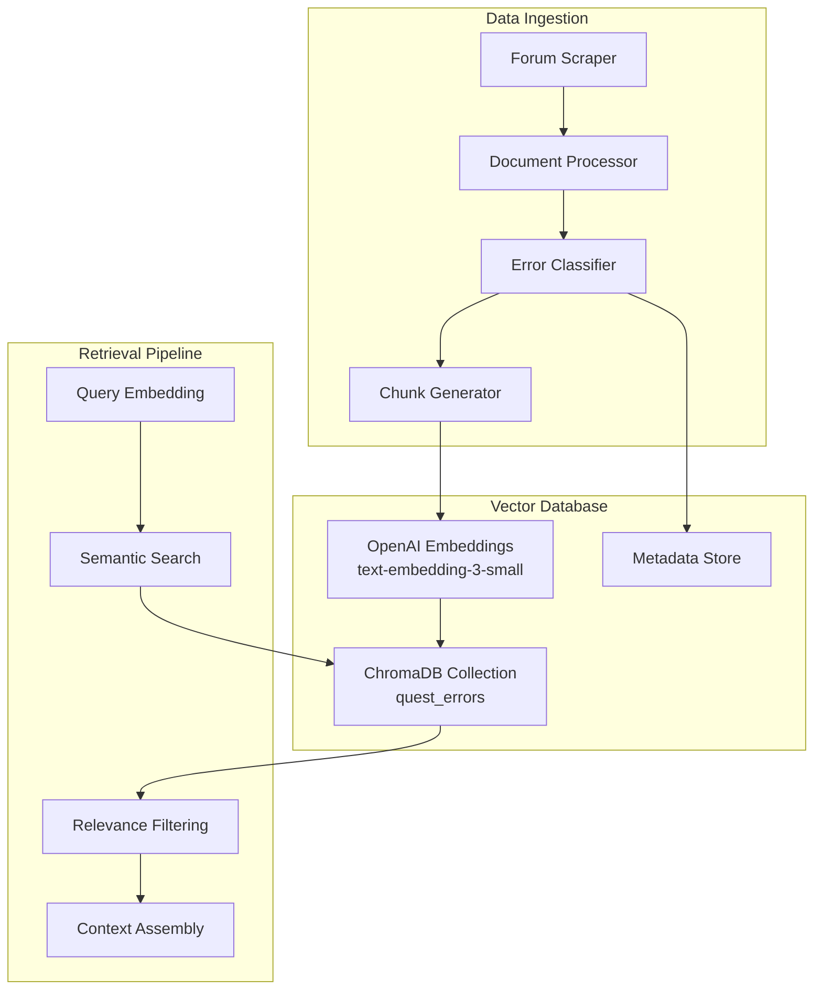

# RAG Implementation with ChromaDB

## Overview

The Quest Dev Copilot uses a sophisticated Retrieval-Augmented Generation (RAG) system to provide contextual, accurate fixes for Unreal Engine Quest development errors. This document details the implementation architecture, data processing pipeline, and optimization strategies.

## Architecture



## Core Components

### 1. Document Processing Pipeline

#### Forum Content Scraper
```python
class QuestForumScraper:
    def __init__(self):
        self.epic_base = "https://forums.unrealengine.com"
        self.meta_base = "https://communityforums.atmeta.com"
        self.error_patterns = {
            'plugin_conflict': [
                r'OpenXR.*failed.*MetaXR',
                r'Plugin.*conflict.*XR',
                r'Multiple XR plugins enabled'
            ],
            'sdk_mismatch': [
                r'Target SDK.*33.*required',
                r'Android SDK.*version.*mismatch',
                r'SDK.*32.*unsupported'
            ],
            'black_screen': [
                r'black.*screen.*Quest',
                r'3 dots.*loading',
                r'blank.*view.*headset'
            ]
        }
```

**Data Sources:**
- Epic Games Forums (forums.unrealengine.com)
- Meta Developer Forums (communityforums.atmeta.com)
- Community GitHub Issues
- Official documentation pages

**Content Types:**
- Forum posts with error logs
- Solution descriptions
- Step-by-step fixes
- Configuration examples
- Community discussions

#### Smart Document Chunking
```python
class DocumentProcessor:
    def chunk_documents(self, documents: List[Dict]) -> List[Dict]:
        """Smart chunking that preserves error context"""
        chunks = []
        
        for doc in documents:
            text = doc['content']
            error_type = doc['error_type']
            
            # Special handling for log snippets - keep them intact
            if self._is_log_snippet(text):
                chunks.append({
                    'content': text,
                    'metadata': {
                        'source': doc['url'],
                        'error_type': error_type,
                        'chunk_type': 'log',
                        'timestamp': doc.get('timestamp', '')
                    }
                })
            else:
                # Regular text chunking with overlap
                for i in range(0, len(text), self.chunk_size - self.overlap):
                    chunk_text = text[i:i + self.chunk_size]
                    chunks.append({
                        'content': chunk_text,
                        'metadata': {
                            'source': doc['url'],
                            'error_type': error_type,
                            'chunk_type': 'text',
                            'chunk_index': i // (self.chunk_size - self.overlap)
                        }
                    })
        
        return chunks
```

**Chunking Strategy:**
- **Log Snippets**: Preserved intact to maintain error context
- **Forum Posts**: 1000 character chunks with 200 character overlap
- **Documentation**: Section-based chunking following headers
- **Code Examples**: Complete function/configuration blocks

### 2. Vector Database Implementation

#### ChromaDB Configuration
```python
class QuestKnowledgeBase:
    def __init__(self, persist_path: Optional[str] = None):
        # In-memory for hackathon, persistent for production
        if persist_path:
            self.client = chromadb.PersistentClient(path=persist_path)
        else:
            self.client = chromadb.Client()
        
        # OpenAI embeddings for high quality
        self.embedding_function = embedding_functions.OpenAIEmbeddingFunction(
            api_key="YOUR_OPENAI_KEY",
            model_name="text-embedding-3-small"
        )
        
        # Cosine similarity for semantic search
        self.collection = self.client.get_or_create_collection(
            name="quest_errors",
            embedding_function=self.embedding_function,
            metadata={"hnsw:space": "cosine"}
        )
```

**Database Schema:**
```json
{
  "id": "doc_1234",
  "content": "Error text and solution content",
  "metadata": {
    "source": "https://forums.unrealengine.com/...",
    "error_type": "plugin_conflict",
    "chunk_type": "log|text|code",
    "timestamp": "2024-01-15T10:30:00Z",
    "confidence": 0.95,
    "solution_verified": true,
    "upvotes": 42
  },
  "embedding": [0.1, -0.2, 0.3, ...]
}
```

#### Metadata-Based Filtering
```python
def search(self, query: str, error_type: Optional[str] = None, k: int = 5) -> List[Dict]:
    """Search with optional error type filtering"""
    where_clause = None
    if error_type and error_type != 'other':
        where_clause = {"error_type": error_type}
    
    results = self.collection.query(
        query_texts=[query],
        n_results=k,
        where=where_clause
    )
    
    return self._format_results(results)
```

### 3. Embedding Strategy

#### Model Selection: OpenAI text-embedding-3-small
**Rationale:**
- **High Quality**: Superior semantic understanding vs. open-source alternatives
- **Cost Efficient**: $0.02 per 1M tokens (very affordable for embeddings)
- **Fast**: Low latency for real-time queries
- **Stable**: Consistent results across different query types

#### Optimization Techniques

**1. Embedding Caching**
```python
class EmbeddingCache:
    def __init__(self, cache_dir: str = "./data/embedding_cache"):
        self.cache_dir = Path(cache_dir)
        self.cache_dir.mkdir(exist_ok=True)
        self._cache = {}
    
    def get_embedding(self, text: str) -> Optional[List[float]]:
        """Get cached embedding or return None"""
        text_hash = hashlib.md5(text.encode()).hexdigest()
        cache_file = self.cache_dir / f"{text_hash}.pkl"
        
        if cache_file.exists():
            with open(cache_file, 'rb') as f:
                return pickle.load(f)
        return None
    
    def store_embedding(self, text: str, embedding: List[float]):
        """Store embedding in cache"""
        text_hash = hashlib.md5(text.encode()).hexdigest()
        cache_file = self.cache_dir / f"{text_hash}.pkl"
        
        with open(cache_file, 'wb') as f:
            pickle.dump(embedding, f)
```

**2. Batch Processing**
```python
async def process_documents_batch(self, documents: List[Dict], batch_size: int = 20):
    """Process documents in batches for efficiency"""
    for i in range(0, len(documents), batch_size):
        batch = documents[i:i + batch_size]
        
        # Extract texts for batch embedding
        texts = [doc['content'] for doc in batch]
        
        # Get embeddings in batch (more cost-effective)
        embeddings = await self.embedding_client.get_embeddings_batch(texts)
        
        # Store in ChromaDB
        self.collection.add(
            documents=texts,
            embeddings=embeddings,
            metadatas=[doc['metadata'] for doc in batch],
            ids=[f"doc_{i+j}" for j in range(len(batch))]
        )
```

### 4. Query Processing

#### Multi-Stage Retrieval
```python
def enhanced_search(self, query: str, error_type: str, max_results: int = 5) -> List[Dict]:
    """Multi-stage retrieval with relevance filtering"""
    
    # Stage 1: Initial semantic search (get more candidates)
    initial_results = self.collection.query(
        query_texts=[query],
        n_results=max_results * 3,  # Get 3x more candidates
        where={"error_type": error_type}
    )
    
    # Stage 2: Relevance filtering
    filtered_results = []
    for i, (doc, distance) in enumerate(zip(initial_results['documents'][0], 
                                           initial_results['distances'][0])):
        
        # Apply distance threshold
        if distance < 0.7:  # Cosine similarity > 0.3
            
            # Apply keyword matching boost
            relevance_score = self._calculate_relevance(query, doc, distance)
            
            filtered_results.append({
                'content': doc,
                'metadata': initial_results['metadatas'][0][i],
                'relevance_score': relevance_score,
                'distance': distance
            })
    
    # Stage 3: Re-rank by relevance score
    filtered_results.sort(key=lambda x: x['relevance_score'], reverse=True)
    
    return filtered_results[:max_results]

def _calculate_relevance(self, query: str, document: str, distance: float) -> float:
    """Calculate relevance score combining semantic and keyword matching"""
    
    # Base score from semantic similarity
    semantic_score = 1.0 - distance
    
    # Keyword matching boost
    query_words = set(query.lower().split())
    doc_words = set(document.lower().split())
    keyword_overlap = len(query_words.intersection(doc_words)) / len(query_words)
    
    # Error-specific keyword boost
    error_keywords = {
        'plugin_conflict': ['openxr', 'metaxr', 'plugin', 'conflict'],
        'sdk_mismatch': ['sdk', 'version', 'android', 'target'],
        'black_screen': ['black', 'screen', 'render', 'display']
    }
    
    error_type = self._detect_error_type(query)
    if error_type in error_keywords:
        error_keyword_boost = len([kw for kw in error_keywords[error_type] 
                                  if kw in document.lower()]) * 0.1
    else:
        error_keyword_boost = 0
    
    # Combine scores
    final_score = (semantic_score * 0.7 + 
                   keyword_overlap * 0.2 + 
                   error_keyword_boost * 0.1)
    
    return final_score
```

#### Query Enhancement
```python
def enhance_query(self, original_query: str, error_classification: Dict) -> str:
    """Enhance query with error context and synonyms"""
    
    enhanced_parts = [original_query]
    
    # Add error type context
    error_type = error_classification.get('error_type')
    if error_type:
        enhanced_parts.append(f"error type: {error_type}")
    
    # Add key indicators
    indicators = error_classification.get('key_indicators', [])
    if indicators:
        enhanced_parts.extend(indicators[:3])  # Top 3 indicators
    
    # Add synonyms for common terms
    synonyms = {
        'quest': ['oculus', 'vr', 'headset'],
        'plugin': ['addon', 'extension', 'module'],
        'error': ['issue', 'problem', 'failure'],
        'black screen': ['blank display', 'no render', 'empty view']
    }
    
    for term, syns in synonyms.items():
        if term in original_query.lower():
            enhanced_parts.extend(syns)
    
    return ' '.join(enhanced_parts)
```

### 5. Performance Optimization

#### Indexing Strategy
```python
# ChromaDB HNSW index parameters for optimal performance
collection_config = {
    "hnsw": {
        "space": "cosine",           # Best for semantic similarity
        "M": 16,                     # Number of connections (balance speed/accuracy)
        "ef_construction": 200,      # Quality of index construction
        "ef": 10,                    # Search effort (runtime parameter)
        "max_elements": 100000       # Expected collection size
    }
}
```

#### Memory Management
```python
class MemoryOptimizedKnowledgeBase:
    def __init__(self, max_memory_mb: int = 512):
        self.max_memory_mb = max_memory_mb
        self._embedding_cache = LRUCache(maxsize=1000)
        self._query_cache = LRUCache(maxsize=100)
    
    def search_with_caching(self, query: str, **kwargs) -> List[Dict]:
        """Search with result caching for repeated queries"""
        cache_key = f"{query}_{hash(str(sorted(kwargs.items())))}"
        
        if cache_key in self._query_cache:
            return self._query_cache[cache_key]
        
        results = self.search(query, **kwargs)
        self._query_cache[cache_key] = results
        return results
```

### 6. Quality Assurance

#### Evaluation Metrics
```python
class RAGEvaluator:
    def evaluate_retrieval_quality(self, test_queries: List[Dict]) -> Dict:
        """Evaluate retrieval quality using test queries"""
        
        metrics = {
            'precision_at_k': [],
            'recall_at_k': [],
            'mrr': [],  # Mean Reciprocal Rank
            'ndcg': []  # Normalized Discounted Cumulative Gain
        }
        
        for query_data in test_queries:
            query = query_data['query']
            expected_docs = query_data['relevant_docs']
            
            # Get retrieved documents
            retrieved = self.knowledge_base.search(query, k=5)
            retrieved_ids = [doc['metadata']['source'] for doc in retrieved]
            
            # Calculate metrics
            precision = len(set(retrieved_ids) & set(expected_docs)) / len(retrieved_ids)
            recall = len(set(retrieved_ids) & set(expected_docs)) / len(expected_docs)
            
            metrics['precision_at_k'].append(precision)
            metrics['recall_at_k'].append(recall)
        
        # Average metrics
        return {
            'avg_precision@5': np.mean(metrics['precision_at_k']),
            'avg_recall@5': np.mean(metrics['recall_at_k']),
            'total_queries': len(test_queries)
        }
```

#### Content Quality Filters
```python
def filter_low_quality_content(self, documents: List[Dict]) -> List[Dict]:
    """Filter out low-quality documents before indexing"""
    
    filtered = []
    for doc in documents:
        content = doc['content']
        
        # Length filters
        if len(content) < 50 or len(content) > 5000:
            continue
        
        # Language detection (English only)
        if not self._is_english(content):
            continue
        
        # Spam detection
        if self._is_spam(content):
            continue
        
        # Technical content validation
        if not self._contains_technical_content(content):
            continue
        
        filtered.append(doc)
    
    return filtered

def _contains_technical_content(self, text: str) -> bool:
    """Check if text contains relevant technical content"""
    technical_terms = [
        'unreal', 'engine', 'quest', 'vr', 'android',
        'plugin', 'sdk', 'openxr', 'metaxr', 'error',
        'log', 'build', 'packaging', 'uproject'
    ]
    
    text_lower = text.lower()
    found_terms = sum(1 for term in technical_terms if term in text_lower)
    return found_terms >= 2  # At least 2 technical terms
```

### 7. Cost Optimization

#### Embedding Cost Management
```python
class CostOptimizedEmbedding:
    def __init__(self, daily_budget_usd: float = 10.0):
        self.daily_budget = daily_budget_usd
        self.cost_per_1k_tokens = 0.00002  # OpenAI text-embedding-3-small
        self.daily_usage = 0.0
        self.token_count = 0
    
    async def get_embeddings_with_budget(self, texts: List[str]) -> List[List[float]]:
        """Get embeddings while respecting budget constraints"""
        
        # Estimate cost
        estimated_tokens = sum(len(text.split()) * 1.3 for text in texts)  # ~1.3 tokens per word
        estimated_cost = (estimated_tokens / 1000) * self.cost_per_1k_tokens
        
        if self.daily_usage + estimated_cost > self.daily_budget:
            raise BudgetExceededException(f"Would exceed daily budget: ${self.daily_budget}")
        
        # Process embeddings
        embeddings = await self.embedding_client.create_embeddings(texts)
        
        # Track usage
        actual_tokens = sum(len(self.tokenizer.encode(text)) for text in texts)
        actual_cost = (actual_tokens / 1000) * self.cost_per_1k_tokens
        
        self.daily_usage += actual_cost
        self.token_count += actual_tokens
        
        logger.info(f"Embeddings created: {actual_tokens} tokens, ${actual_cost:.4f}")
        
        return embeddings
```

### 8. Monitoring and Analytics

#### Performance Tracking
```python
class RAGMetrics:
    def __init__(self):
        self.search_times = []
        self.result_relevance = []
        self.cache_hit_rate = 0
        self.embedding_costs = 0
    
    def track_search(self, query: str, results: List[Dict], response_time: float):
        """Track search performance metrics"""
        
        self.search_times.append(response_time)
        
        # Track relevance (simplified - could use user feedback)
        avg_distance = np.mean([r.get('distance', 1.0) for r in results])
        relevance_score = 1.0 - avg_distance
        self.result_relevance.append(relevance_score)
        
        # Log metrics
        logger.info(f"Search completed: {len(results)} results, "
                   f"{response_time:.2f}s, relevance: {relevance_score:.2f}")
    
    def get_daily_report(self) -> Dict:
        """Generate daily performance report"""
        return {
            'total_searches': len(self.search_times),
            'avg_response_time': np.mean(self.search_times) if self.search_times else 0,
            'avg_relevance': np.mean(self.result_relevance) if self.result_relevance else 0,
            'cache_hit_rate': self.cache_hit_rate,
            'embedding_cost': self.embedding_costs,
            'p95_response_time': np.percentile(self.search_times, 95) if self.search_times else 0
        }
```

## Best Practices

### 1. Data Quality
- **Source Verification**: Only index content from trusted forums and documentation
- **Content Filtering**: Remove spam, duplicate, and low-quality posts
- **Version Control**: Track document versions and update embeddings for changed content
- **Manual Curation**: Manually verify high-impact solutions

### 2. Search Optimization
- **Query Enhancement**: Expand queries with synonyms and context
- **Result Diversity**: Ensure results cover different solution approaches
- **Relevance Tuning**: Continuously adjust similarity thresholds based on user feedback
- **Error Type Specificity**: Use metadata filtering to improve precision

### 3. Cost Management
- **Embedding Caching**: Never re-embed identical content
- **Batch Processing**: Process embeddings in batches for better rates
- **Budget Monitoring**: Set daily/monthly spending limits
- **Model Selection**: Use appropriate embedding models for cost/quality balance

### 4. Performance
- **Index Optimization**: Tune HNSW parameters for your data size and query patterns
- **Memory Management**: Use LRU caches for frequently accessed data
- **Lazy Loading**: Load embeddings on-demand rather than keeping everything in memory
- **Connection Pooling**: Reuse database connections and HTTP sessions

## Testing Strategy

### Unit Tests
```python
def test_document_chunking():
    processor = DocumentProcessor(chunk_size=100, overlap=20)
    documents = [
        {
            'content': 'A' * 150 + 'B' * 150,
            'url': 'test.com',
            'error_type': 'test'
        }
    ]
    
    chunks = processor.chunk_documents(documents)
    assert len(chunks) == 4  # Expected number of chunks
    assert len(chunks[0]['content']) <= 100  # Chunk size limit
    assert 'AAAA' in chunks[1]['content']  # Overlap verification

def test_search_filtering():
    kb = QuestKnowledgeBase()
    # Add test documents with different error types
    # Test that filtering works correctly
```

### Integration Tests
```python
async def test_end_to_end_retrieval():
    # Test complete pipeline from query to results
    scraper = QuestForumScraper()
    processor = DocumentProcessor()
    kb = QuestKnowledgeBase()
    
    # Scrape test content
    documents = await scraper.scrape_test_content()
    
    # Process and index
    chunks = processor.chunk_documents(documents)
    kb.add_documents(chunks)
    
    # Test search
    results = kb.search("OpenXR plugin conflict Quest", error_type="plugin_conflict")
    
    assert len(results) > 0
    assert all(r['metadata']['error_type'] == 'plugin_conflict' for r in results)
```

### Performance Tests
```python
def test_search_performance():
    kb = QuestKnowledgeBase()
    # Index 10k documents
    
    start_time = time.time()
    results = kb.search("test query")
    response_time = time.time() - start_time
    
    assert response_time < 1.0  # Sub-second response time
    assert len(results) <= 5  # Expected result count
```

## Production Deployment

### Database Configuration
```python
# Production ChromaDB settings
production_config = {
    "persist_directory": "/data/chroma_production",
    "collection_metadata": {
        "hnsw:space": "cosine",
        "hnsw:M": 32,  # Higher for better accuracy
        "hnsw:ef_construction": 400,
        "hnsw:max_elements": 1000000  # Scale for production
    }
}
```

### Monitoring Setup
```python
# Integration with monitoring systems
import structlog
from prometheus_client import Counter, Histogram

search_counter = Counter('rag_searches_total', 'Total RAG searches')
search_duration = Histogram('rag_search_duration_seconds', 'RAG search duration')
relevance_score = Histogram('rag_relevance_score', 'RAG result relevance')

@search_duration.time()
def search_with_metrics(query: str, **kwargs):
    search_counter.inc()
    results = kb.search(query, **kwargs)
    
    # Track relevance
    if results:
        avg_relevance = 1.0 - np.mean([r.get('distance', 1.0) for r in results])
        relevance_score.observe(avg_relevance)
    
    return results
```

This RAG implementation provides the foundation for accurate, fast, and cost-effective retrieval of relevant Quest development solutions, enabling the AI to provide contextual and helpful fixes for complex Unreal Engine errors.