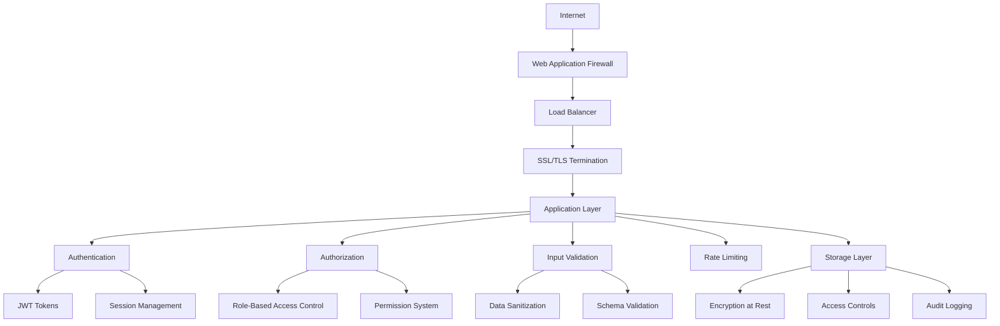
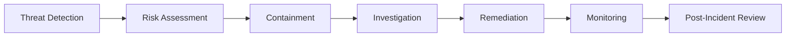

# Security Overview

Malkuth Platform implements comprehensive security measures to protect user data, ensure platform integrity, and maintain compliance with industry standards. This document provides an overview of our security architecture and practices.

## 🛡️ Security Architecture

### Defense in Depth

Our security strategy employs multiple layers of protection:



### Security Layers

1. **Network Security**: Firewalls, DDoS protection, secure protocols
2. **Application Security**: Authentication, authorization, input validation
3. **Data Security**: Encryption, access controls, data integrity
4. **Infrastructure Security**: Secure hosting, monitoring, incident response
5. **Compliance**: GDPR, CCPA, industry standards adherence

## 🔐 Authentication and Authorization

### Authentication Methods

#### JWT Token Authentication
```typescript
interface JWTToken {
  sub: string;           // User ID
  email: string;         // User email
  role: UserRole;        // User role
  permissions: string[]; // Granted permissions
  iat: number;          // Issued at
  exp: number;          // Expiration time
  jti: string;          // Token ID for revocation
}
```

**Features:**
- Stateless authentication
- Short-lived access tokens (15 minutes)
- Refresh token rotation
- Token revocation capability
- Secure token storage

#### API Key Authentication
```typescript
interface APIKey {
  id: string;
  userId: string;
  name: string;
  keyHash: string;       // Hashed key value
  permissions: Permission[];
  rateLimit: RateLimit;
  lastUsed: Date;
  expiresAt?: Date;
  isActive: boolean;
}
```

**Features:**
- Scoped permissions
- Rate limiting per key
- Usage tracking
- Automatic expiration
- Key rotation support

### Authorization Framework

#### Role-Based Access Control (RBAC)
```typescript
enum UserRole {
  ADMIN = 'admin',
  CONTENT_CREATOR = 'content_creator',
  VIEWER = 'viewer',
  BOT_MANAGER = 'bot_manager',
  ANALYST = 'analyst'
}

interface Permission {
  resource: string;      // e.g., 'content', 'bots', 'analytics'
  action: string;        // e.g., 'read', 'write', 'delete', 'admin'
  conditions?: object;   // Additional constraints
}
```

#### Permission Matrix
| Role | Content | Bots | Analytics | Campaigns | System |
|------|---------|------|-----------|-----------|---------|
| Admin | Full | Full | Full | Full | Full |
| Content Creator | Own Content | View | Own Content | Own Campaigns | None |
| Viewer | Read Only | None | None | None | None |
| Bot Manager | Read Only | Full | Bot Analytics | Bot Campaigns | None |
| Analyst | Read Only | View | Full | View | Health |

### Session Management

#### Secure Session Handling
```typescript
interface SecureSession {
  sessionId: string;
  userId: string;
  ipAddress: string;
  userAgent: string;
  createdAt: Date;
  lastActivity: Date;
  expiresAt: Date;
  isActive: boolean;
}
```

**Security Features:**
- Session timeout (24 hours)
- IP address binding
- User agent validation
- Concurrent session limits
- Automatic cleanup

## 🔒 Data Security

### Encryption

#### Encryption at Rest
- **File Storage**: AES-256 encryption for all stored files
- **Database**: Transparent data encryption (TDE)
- **Backups**: Encrypted backup storage
- **Keys**: Hardware security module (HSM) key management

#### Encryption in Transit
- **TLS 1.3**: All communications encrypted
- **HSTS**: HTTP Strict Transport Security enabled
- **Certificate Pinning**: API client certificate validation
- **Perfect Forward Secrecy**: Session key rotation

### Data Classification

#### Data Sensitivity Levels
```typescript
enum DataSensitivity {
  PUBLIC = 'public',           // Publicly accessible content
  INTERNAL = 'internal',       // Platform operational data
  CONFIDENTIAL = 'confidential', // User personal data
  RESTRICTED = 'restricted'    // Admin and system data
}
```

#### Data Handling Requirements
| Level | Encryption | Access Control | Audit Logging | Retention |
|-------|------------|----------------|---------------|-----------|
| Public | Optional | Public | Basic | Standard |
| Internal | Required | Authenticated | Standard | Extended |
| Confidential | Required | Authorized | Enhanced | Limited |
| Restricted | Required | Admin Only | Full | Minimal |

### Data Privacy

#### Personal Data Protection
- **Data Minimization**: Collect only necessary data
- **Purpose Limitation**: Use data only for stated purposes
- **Consent Management**: Clear consent mechanisms
- **Right to Erasure**: Data deletion capabilities
- **Data Portability**: Export user data

#### Privacy Controls
```typescript
interface PrivacySettings {
  userId: string;
  dataProcessingConsent: boolean;
  analyticsOptOut: boolean;
  marketingOptOut: boolean;
  dataRetentionPeriod: number;    // Days
  deleteAfterInactivity: number;  // Days
}
```

## 🚫 Input Validation and Sanitization

### Validation Framework

#### Request Validation
```typescript
interface ValidationSchema {
  field: string;
  type: 'string' | 'number' | 'boolean' | 'array' | 'object';
  required: boolean;
  constraints?: {
    minLength?: number;
    maxLength?: number;
    pattern?: RegExp;
    min?: number;
    max?: number;
    enum?: string[];
  };
  sanitization?: SanitizationRule[];
}
```

#### File Upload Validation
```typescript
interface FileValidation {
  allowedTypes: string[];        // MIME types
  maxSize: number;              // Bytes
  scanForMalware: boolean;
  quarantineOnSuspicion: boolean;
  contentTypeValidation: boolean;
  filenameValidation: RegExp;
}
```

### XSS Protection

#### Content Sanitization
- **HTML Sanitization**: Remove dangerous HTML elements
- **Script Filtering**: Block JavaScript execution
- **URL Validation**: Validate and sanitize URLs
- **Content Security Policy**: Strict CSP headers

#### Output Encoding
```typescript
const sanitizeOutput = {
  html: (input: string) => escapeHtml(input),
  attribute: (input: string) => escapeAttribute(input),
  javascript: (input: string) => escapeJavaScript(input),
  url: (input: string) => encodeURIComponent(input)
};
```

### SQL Injection Prevention

#### Parameterized Queries
```typescript
// Secure database query
const getUserContent = async (userId: string, contentType: string) => {
  const query = `
    SELECT * FROM content 
    WHERE user_id = $1 AND content_type = $2 
    AND deleted_at IS NULL
  `;
  return await db.query(query, [userId, contentType]);
};
```

#### ORM Security
- **Query Builder**: Use parameterized query builders
- **Input Validation**: Validate all database inputs
- **Least Privilege**: Database user with minimal permissions
- **Connection Security**: Encrypted database connections

## 🔥 Rate Limiting and DDoS Protection

### Rate Limiting Strategy

#### Multi-Tier Rate Limiting
```typescript
interface RateLimit {
  identifier: string;      // IP, user, API key
  window: number;          // Time window in seconds
  maxRequests: number;     // Maximum requests per window
  blockDuration: number;   // Block duration in seconds
  exemptions: string[];    // Exempted identifiers
}
```

#### Rate Limit Tiers
```typescript
const rateLimits = {
  global: { window: 3600, maxRequests: 10000 },     // Per IP
  authenticated: { window: 3600, maxRequests: 5000 }, // Per user
  upload: { window: 3600, maxRequests: 100 },       // Upload endpoints
  analytics: { window: 3600, maxRequests: 1000 },   // Analytics API
  admin: { window: 3600, maxRequests: 500 }         // Admin endpoints
};
```

### DDoS Protection

#### Detection Mechanisms
- **Traffic Analysis**: Unusual traffic pattern detection
- **Request Fingerprinting**: Identify automated requests
- **Geolocation Filtering**: Block suspicious geographic patterns
- **Behavioral Analysis**: Detect non-human behavior patterns

#### Mitigation Strategies
- **Traffic Shaping**: Gradual traffic filtering
- **Challenge Response**: CAPTCHA for suspicious requests
- **IP Blacklisting**: Temporary IP blocks
- **Content Delivery Network**: Distributed traffic handling

## 🔍 Security Monitoring and Logging

### Audit Logging

#### Comprehensive Audit Trail
```typescript
interface AuditLog {
  id: string;
  timestamp: Date;
  userId?: string;
  ipAddress: string;
  userAgent: string;
  action: string;
  resource: string;
  resourceId?: string;
  outcome: 'success' | 'failure' | 'blocked';
  details: object;
  riskLevel: 'low' | 'medium' | 'high' | 'critical';
}
```

#### Logged Events
- **Authentication**: Login, logout, token refresh
- **Authorization**: Permission checks, access denials
- **Data Access**: Content views, modifications, deletions
- **Administrative**: System configuration changes
- **Security Events**: Failed authentications, rate limit violations

### Security Monitoring

#### Real-Time Threat Detection
```typescript
interface SecurityAlert {
  id: string;
  type: ThreatType;
  severity: 'low' | 'medium' | 'high' | 'critical';
  description: string;
  affectedResource: string;
  detectionTime: Date;
  sourceIP: string;
  automated: boolean;
  mitigationActions: string[];
}
```

#### Monitoring Metrics
- **Failed Authentication Attempts**: Track brute force attacks
- **Unusual Access Patterns**: Detect anomalous behavior
- **Rate Limit Violations**: Monitor abuse attempts
- **Error Rates**: Track application security errors
- **Performance Anomalies**: Detect potential attacks

### Incident Response

#### Security Incident Workflow


#### Response Procedures
1. **Detection**: Automated alerts and monitoring
2. **Assessment**: Risk level and impact evaluation
3. **Containment**: Immediate threat isolation
4. **Investigation**: Root cause analysis
5. **Remediation**: Fix vulnerabilities and restore service
6. **Monitoring**: Enhanced monitoring post-incident
7. **Review**: Process improvement and documentation

## 🏢 Compliance and Standards

### Regulatory Compliance

#### GDPR (General Data Protection Regulation)
- **Lawful Basis**: Clear legal basis for data processing
- **Data Subject Rights**: Right to access, rectify, erase, and port data
- **Privacy by Design**: Built-in privacy protections
- **Data Protection Officer**: Appointed DPO for compliance
- **Breach Notification**: 72-hour breach reporting

#### CCPA (California Consumer Privacy Act)
- **Consumer Rights**: Right to know, delete, and opt-out
- **Privacy Disclosures**: Clear privacy policy and notices
- **Third-Party Sharing**: Transparency about data sharing
- **Non-Discrimination**: No discrimination for exercising rights

### Security Standards

#### ISO 27001 Framework
- **Information Security Management**: Systematic approach
- **Risk Assessment**: Regular security risk evaluation
- **Controls Implementation**: Security control deployment
- **Continuous Improvement**: Regular security review and enhancement

#### SOC 2 Type II
- **Security**: Data protection against unauthorized access
- **Availability**: System operational availability
- **Processing Integrity**: Complete and accurate processing
- **Confidentiality**: Data protection per agreements
- **Privacy**: Personal information protection

## 🛠️ Security Tools and Infrastructure

### Security Stack

#### Application Security
- **OWASP ZAP**: Automated security testing
- **SonarQube**: Code quality and security analysis
- **Snyk**: Dependency vulnerability scanning
- **ESLint Security**: JavaScript security linting

#### Infrastructure Security
- **Google Cloud Security**: Native cloud security features
- **Cloudflare**: DDoS protection and WAF
- **Let's Encrypt**: Automated SSL certificate management
- **Fail2Ban**: Intrusion prevention system

### Vulnerability Management

#### Security Testing
```typescript
interface SecurityTest {
  type: 'static' | 'dynamic' | 'interactive' | 'dependency';
  tool: string;
  frequency: 'continuous' | 'daily' | 'weekly' | 'monthly';
  scope: string[];
  automatedRemediation: boolean;
}
```

#### Vulnerability Response
1. **Discovery**: Automated and manual testing
2. **Classification**: CVSS scoring and risk assessment
3. **Prioritization**: Business impact evaluation
4. **Remediation**: Patch development and deployment
5. **Verification**: Fix validation and testing
6. **Monitoring**: Ongoing vulnerability tracking

## 🔧 Developer Security Guidelines

### Secure Coding Practices

#### Code Review Checklist
- [ ] Input validation and sanitization
- [ ] Authentication and authorization checks
- [ ] SQL injection prevention
- [ ] XSS protection
- [ ] Error handling without information disclosure
- [ ] Secure cryptographic implementation
- [ ] Rate limiting implementation
- [ ] Audit logging inclusion

#### Security Testing Requirements
```typescript
interface SecurityTestSuite {
  unitTests: {
    inputValidation: boolean;
    authenticationBypass: boolean;
    authorizationEscalation: boolean;
    injectionPrevention: boolean;
  };
  integrationTests: {
    endToEndSecurity: boolean;
    apiSecurity: boolean;
    fileUploadSecurity: boolean;
    sessionManagement: boolean;
  };
  performanceTests: {
    rateLimitEffectiveness: boolean;
    ddosResistance: boolean;
    resourceExhaustion: boolean;
  };
}
```

### Security Dependencies

#### Dependency Management
- **Automated Updates**: Regular dependency updates
- **Vulnerability Scanning**: Continuous dependency scanning
- **License Compliance**: Open source license verification
- **Supply Chain Security**: Verified package sources

## 📋 Security Policies

### Access Control Policy

#### User Access Management
1. **Principle of Least Privilege**: Minimum necessary access
2. **Regular Access Review**: Quarterly access audits
3. **Onboarding/Offboarding**: Automated access provisioning
4. **Multi-Factor Authentication**: Required for admin access
5. **Password Policy**: Strong password requirements

### Data Retention Policy

#### Retention Schedules
- **User Data**: 7 years or until deletion request
- **Audit Logs**: 10 years for compliance
- **Analytics Data**: 3 years for business purposes
- **Backup Data**: 30 days for recovery purposes
- **Temporary Data**: 24 hours maximum

### Incident Response Policy

#### Response Team
- **Security Lead**: Overall incident coordination
- **Technical Lead**: Technical investigation and remediation
- **Legal Counsel**: Compliance and notification requirements
- **Communications**: Internal and external communications
- **Management**: Executive decision making

## 📚 Security Resources

### Training and Awareness

#### Security Training Program
- **New Employee Training**: Security awareness basics
- **Role-Specific Training**: Position-relevant security training
- **Ongoing Education**: Regular security updates and training
- **Phishing Simulation**: Regular phishing awareness tests
- **Incident Response Drills**: Practice security incident response

### Documentation and Procedures

- [API Security Guidelines](./API_SECURITY.md)
- [Data Privacy Guide](./DATA_PRIVACY.md)
- [Compliance Requirements](./COMPLIANCE.md)
- [Security Best Practices](./BEST_PRACTICES.md)
- [Incident Response Playbook](./INCIDENT_RESPONSE.md)

## 📞 Security Contact

### Reporting Security Issues

**Security Team Contact:**
- 📧 Email: security@malkuth-platform.com
- 🔒 PGP Key: Available on request
- 📱 Emergency: +1-XXX-XXX-XXXX
- 🌐 Bug Bounty: https://malkuth.com/security/bounty

### Responsible Disclosure

We appreciate security researchers who help improve our platform security. Please follow responsible disclosure practices:

1. **Private Reporting**: Report vulnerabilities privately first
2. **Reasonable Timeline**: Allow reasonable time for remediation
3. **No Data Access**: Don't access or modify user data
4. **Scope Limitation**: Test only within authorized scope
5. **Good Faith**: Act in good faith to protect user security

---

This security overview provides a comprehensive foundation for understanding Malkuth Platform's security posture. For specific implementation details, refer to the individual security guides and contact our security team for any questions or concerns.