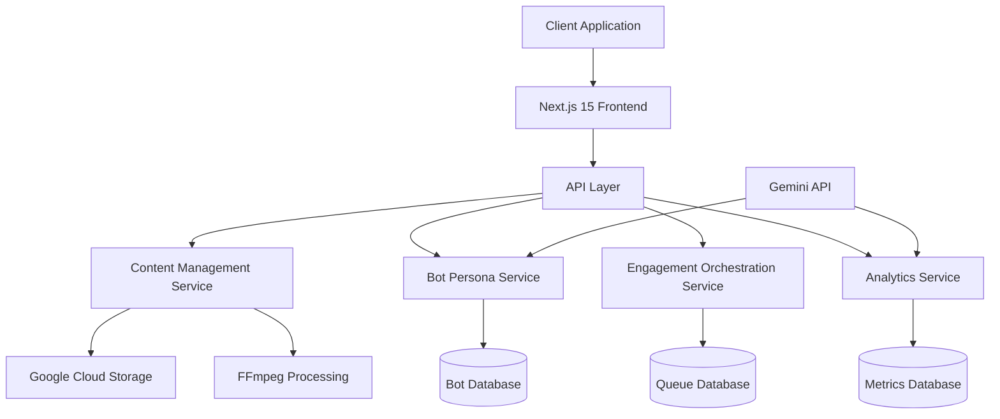
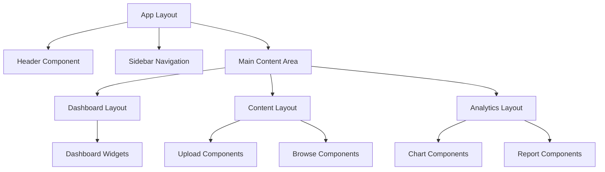
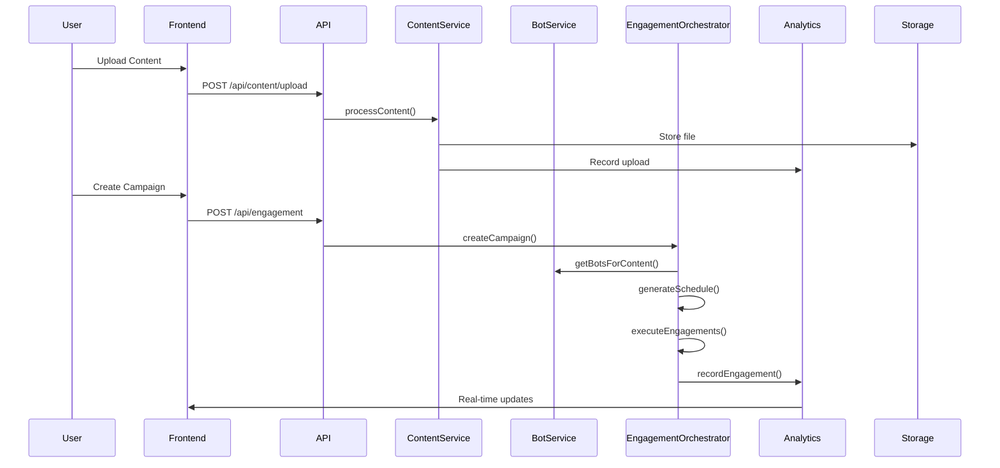
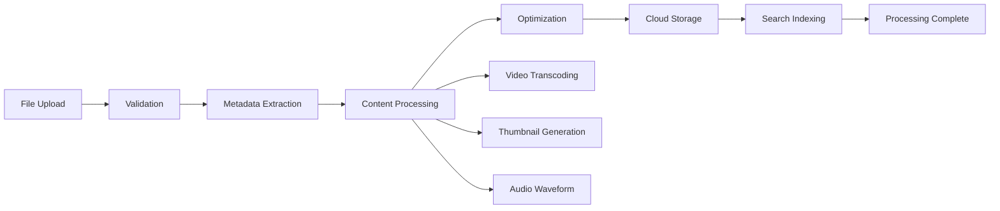
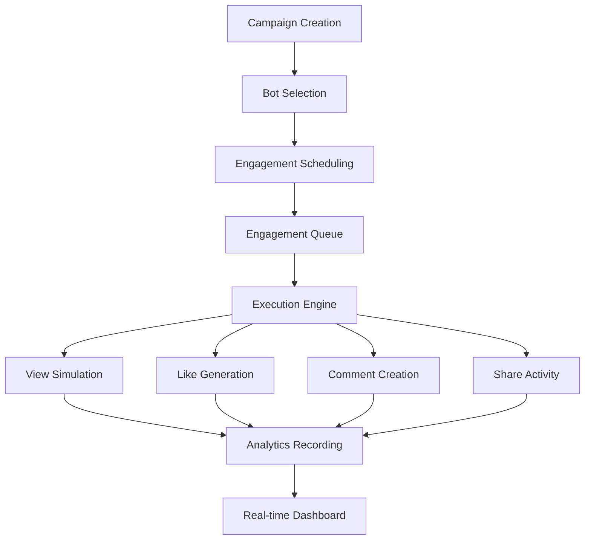
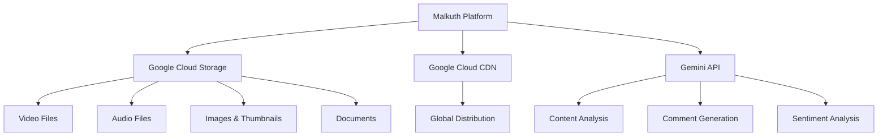
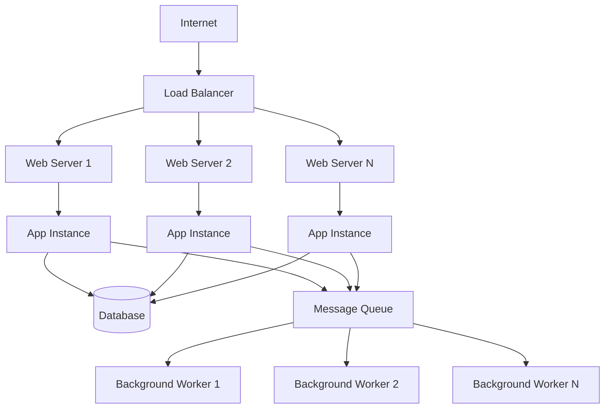
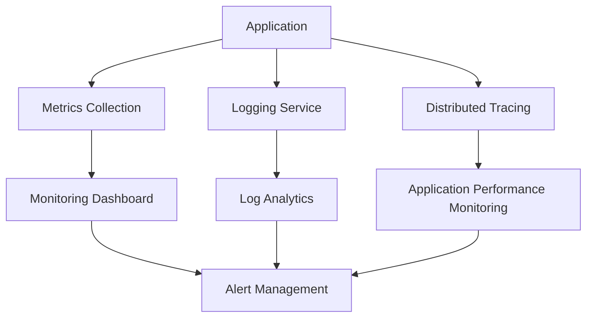

# Malkuth Platform - Technical Architecture

## 🏗 System Overview

Malkuth Platform is built as a modern, scalable web application using Next.js 15 with a sophisticated backend service architecture. The system is designed around three core pillars: Content Management, Bot Orchestration, and Analytics.



## 🏢 Application Architecture

### Frontend Architecture

```typescript
// Next.js 15 App Router Structure
src/
├── app/                    # App Router Pages
│   ├── (dashboard)/        # Route Groups
│   │   ├── analytics/      # Analytics Dashboard
│   │   ├── content/        # Content Management
│   │   └── engagement/     # Engagement Control
│   ├── api/               # API Routes
│   └── layout.tsx         # Root Layout
│
├── components/            # React Components
│   ├── analytics/         # Analytics UI Components
│   ├── content/          # Content Management UI
│   ├── layout/           # Layout Components
│   └── ui/               # Base UI Components
│
├── services/             # Business Logic Services
├── lib/                  # Utility Libraries
├── types/                # TypeScript Definitions
└── styles/               # Global Styles
```

### Component Architecture

The frontend follows a hierarchical component structure:



## 🔧 Service Architecture

### Core Services

#### 1. Content Management Service
```typescript
interface ContentManagementService {
  // Content CRUD operations
  uploadContent(file: File, metadata: ContentMetadata): Promise<Content>;
  getContent(id: string): Promise<Content>;
  updateContent(id: string, updates: Partial<Content>): Promise<Content>;
  deleteContent(id: string): Promise<void>;
  
  // Content processing
  processVideo(content: VideoContent): Promise<ProcessedVideo>;
  extractMetadata(file: File): Promise<Metadata>;
  generateThumbnails(video: VideoContent): Promise<string[]>;
}
```

#### 2. Bot Persona Service
```typescript
interface BotPersonaService {
  // Bot management
  createBot(params: BotCreationParams): Promise<BotPersona>;
  getBot(id: string): Promise<BotPersona>;
  updateBot(id: string, updates: Partial<BotPersona>): Promise<BotPersona>;
  
  // Bot selection and matching
  getBotsForContent(content: Content): Promise<BotPersona[]>;
  generateInteractionPattern(bot: BotPersona, content: Content): BotInteractionPattern;
  
  // Analytics
  getBotAnalytics(botId: string): Promise<BotAnalytics>;
}
```

#### 3. Engagement Orchestration Service
```typescript
interface EngagementOrchestrator {
  // Campaign management
  createCampaign(content: Content, params: EngagementParameters): Promise<EngagementCampaign>;
  startCampaign(campaignId: string): Promise<void>;
  pauseCampaign(campaignId: string): Promise<void>;
  stopCampaign(campaignId: string): Promise<void>;
  
  // Engagement execution
  scheduleEngagement(engagement: Engagement): Promise<void>;
  executeEngagement(engagement: Engagement): Promise<void>;
  
  // Analytics and monitoring
  getCampaignAnalytics(campaignId: string): Promise<CampaignAnalytics>;
}
```

#### 4. Analytics Service
```typescript
interface AnalyticsService {
  // Metrics collection
  recordEngagement(engagement: Engagement): Promise<void>;
  recordContentView(contentId: string, metadata: ViewMetadata): Promise<void>;
  recordBotActivity(botId: string, activity: BotActivity): Promise<void>;
  
  // Analytics queries
  getOverviewMetrics(period: TimePeriod): Promise<OverviewMetrics>;
  getContentAnalytics(contentId: string): Promise<ContentAnalytics>;
  getBotPerformance(botId: string): Promise<BotPerformance>;
  
  // Reporting
  generateReport(params: ReportParams): Promise<AnalyticsReport>;
  exportData(params: ExportParams): Promise<ExportResult>;
}
```

## 🗄 Data Architecture

### Data Models

#### Content Model
```typescript
interface Content {
  id: string;
  title: string;
  description: string;
  type: 'video' | 'writing' | 'music';
  url: string;
  thumbnailUrl?: string;
  metadata: ContentMetadata;
  tags: string[];
  category: string;
  author: string;
  createdAt: Date;
  updatedAt: Date;
}

interface VideoContent extends Content {
  type: 'video';
  duration: number;
  resolution: string;
  codec: string;
  processedFormats: ProcessedFormat[];
}

interface MusicContent extends Content {
  type: 'music';
  duration: number;
  waveformData: number[];
  metadata: AudioMetadata;
}

interface WritingContent extends Content {
  type: 'writing';
  content: string;
  wordCount: number;
  readingTime: number;
  format: 'markdown' | 'html';
}
```

#### Bot Persona Model
```typescript
interface BotPersona {
  id: string;
  name: string;
  personality: string;
  interests: string[];
  engagementStyle: EngagementStyle;
  demographics: {
    age: number;
    location: string;
    timezone: string;
  };
  behaviorPatterns: {
    activeHours: number[];
    engagementFrequency: 'low' | 'medium' | 'high';
    contentPreferences: string[];
  };
  createdAt: Date;
  isActive: boolean;
}
```

#### Engagement Model
```typescript
interface Engagement {
  id: string;
  contentId: string;
  botId: string;
  type: EngagementType;
  value?: string;
  scheduledAt: Date;
  executedAt?: Date;
  status: EngagementStatus;
  phase: EngagementPhase;
  metadata: EngagementMetadata;
}

interface EngagementCampaign {
  id: string;
  contentId: string;
  targetMetrics: TargetMetrics;
  parameters: EngagementParameters;
  status: CampaignStatus;
  analytics: CampaignAnalytics;
  createdAt: Date;
  startDate: Date;
  endDate?: Date;
}
```

### Data Flow



## 🔄 Processing Pipelines

### Content Processing Pipeline



### Engagement Processing Pipeline



## 🏗 Infrastructure Architecture

### Cloud Services Integration



### Deployment Architecture



## 🔧 Technology Stack Details

### Frontend Stack
- **Next.js 15**: React framework with App Router
- **React 19**: UI library with concurrent features
- **TypeScript**: Static type checking
- **Tailwind CSS**: Utility-first CSS framework
- **Storybook**: Component development environment

### Backend Stack
- **Node.js**: JavaScript runtime
- **Next.js API Routes**: Serverless API endpoints
- **Google Cloud Storage**: File storage and CDN
- **FFmpeg**: Video and audio processing

### Development Tools
- **ESLint**: Code linting and quality
- **Prettier**: Code formatting
- **Turbopack**: Fast build tool
- **Git**: Version control

## 📊 Performance Considerations

### Optimization Strategies

1. **Frontend Optimization**
   - Code splitting with Next.js dynamic imports
   - Image optimization with Next.js Image component
   - Bundle size monitoring and optimization
   - Progressive Web App features

2. **Backend Optimization**
   - API response caching
   - Database query optimization
   - Background job processing
   - Rate limiting and throttling

3. **Storage Optimization**
   - CDN integration for static assets
   - Compression for media files
   - Lazy loading for large datasets
   - Efficient file formats and sizes

### Scalability Features

1. **Horizontal Scaling**
   - Stateless application design
   - Load balancer compatibility
   - Session management strategies
   - Database connection pooling

2. **Vertical Scaling**
   - Memory optimization
   - CPU-intensive task optimization
   - Efficient data structures
   - Algorithm optimization

## 🔒 Security Architecture

### Security Layers

1. **Transport Security**
   - HTTPS enforcement
   - Certificate management
   - Security headers

2. **Authentication & Authorization**
   - JWT token management
   - Role-based access control
   - API key management

3. **Data Security**
   - Input validation and sanitization
   - SQL injection prevention
   - XSS protection
   - CSRF protection

4. **File Security**
   - File type validation
   - Size restrictions
   - Malware scanning
   - Secure file storage

## 📈 Monitoring & Observability

### Monitoring Stack



### Key Metrics

1. **Application Metrics**
   - Response times
   - Error rates
   - Throughput
   - Resource utilization

2. **Business Metrics**
   - Content upload rates
   - Campaign performance
   - Bot engagement quality
   - User activity patterns

3. **Infrastructure Metrics**
   - Server performance
   - Database performance
   - Storage usage
   - Network latency

## 🔄 Future Architecture Considerations

### Planned Enhancements

1. **Microservices Migration**
   - Service decomposition
   - API gateway implementation
   - Service mesh integration
   - Independent deployment

2. **Real-time Features**
   - WebSocket integration
   - Real-time analytics
   - Live notifications
   - Collaborative features

3. **AI/ML Integration**
   - Enhanced content analysis
   - Predictive analytics
   - Automated optimization
   - Advanced bot behaviors

4. **Multi-tenancy**
   - Tenant isolation
   - Resource management
   - Billing integration
   - White-label solutions

---

This architecture documentation provides a comprehensive overview of the Malkuth Platform's technical design and implementation. For specific implementation details, refer to the individual service documentation.