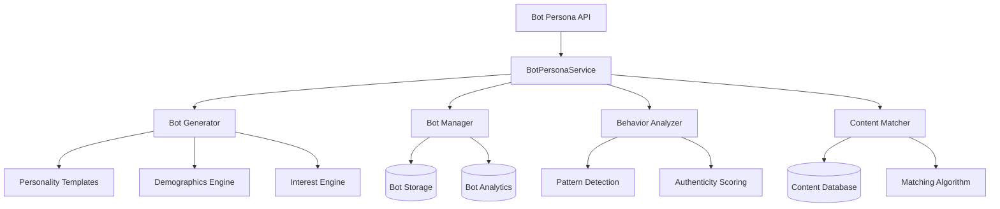

# Bot Persona System Documentation

## 🤖 Overview

The Bot Persona System is the core intelligence layer of Malkuth Platform, designed to create and manage realistic virtual personas that engage with content in authentic, human-like patterns. The system generates diverse bot personalities with unique behavioral characteristics, interests, and engagement styles.

## 🧠 Core Concepts

### Bot Personas

Bot personas are AI-generated virtual users with the following characteristics:

- **Unique Identity**: Name, personality traits, and demographics
- **Interest Profiles**: Content preferences and engagement patterns  
- **Behavioral Patterns**: Activity hours, frequency, and interaction styles
- **Engagement Styles**: Communication approaches and response patterns
- **Authenticity Scores**: Measures of realistic behavior simulation

### Engagement Styles

The system supports five distinct engagement styles:

```typescript
type EngagementStyle = 'casual' | 'professional' | 'enthusiastic' | 'analytical' | 'humorous';
```

Each style influences how bots interact with content:

- **Casual**: Relaxed, informal interactions with moderate engagement
- **Professional**: Formal, business-focused approach with thoughtful responses
- **Enthusiastic**: High energy, frequent interactions with positive sentiment
- **Analytical**: Detailed, data-driven responses with critical thinking
- **Humorous**: Light-hearted, witty responses that add entertainment value

## 🏗 Architecture

### Service Layer Architecture



### Data Model

```typescript
interface BotPersona {
  id: string;
  name: string;
  personality: string;
  interests: string[];
  engagementStyle: EngagementStyle;
  demographics: {
    age: number;
    location: string;
    timezone: string;
  };
  behaviorPatterns: {
    activeHours: number[];
    engagementFrequency: 'low' | 'medium' | 'high';
    contentPreferences: string[];
  };
  createdAt: Date;
  isActive: boolean;
}

interface BotAnalytics {
  totalEngagements: number;
  engagementsByType: Record<string, number>;
  averageAuthenticityScore: number;
  activityPattern: Array<{
    hour: number;
    activity: number;
  }>;
  contentPreferences: Array<{
    category: string;
    engagement: number;
  }>;
  socialConnections: string[];
}
```

## 🎭 Bot Generation

### Personality Generation

The system generates unique personalities using predefined traits:

```typescript
const personalityTraits = [
  'curious', 'analytical', 'creative', 'social', 'introverted', 'extroverted',
  'optimistic', 'skeptical', 'detail-oriented', 'big-picture', 'innovative',
  'traditional', 'adventurous', 'cautious', 'competitive', 'collaborative'
];

// Example generated personality
"analytical, innovative, detail-oriented"
```

### Interest Matching

Bots are assigned interests from 20 categories:

```typescript
const interestCategories = [
  'technology', 'sports', 'entertainment', 'education', 'business', 'science',
  'art', 'music', 'travel', 'food', 'fitness', 'gaming', 'news', 'lifestyle',
  'fashion', 'health', 'environment', 'politics', 'culture', 'history'
];
```

Each bot receives 3-6 interests based on realistic distribution patterns.

### Demographic Distribution

Bots are distributed across realistic demographics:

```typescript
// Age distribution: weighted towards 18-45 demographic
const generateAge = () => {
  const weights = {
    '18-25': 0.25,
    '26-35': 0.35,
    '36-45': 0.25,
    '46-55': 0.10,
    '56-65': 0.05
  };
  return weightedRandom(weights);
};

// Geographic distribution: US-focused with major cities
const locations = [
  'New York, NY', 'Los Angeles, CA', 'Chicago, IL', 'Houston, TX',
  'Phoenix, AZ', 'Philadelphia, PA', 'San Antonio, TX', 'San Diego, CA'
  // ... 25 major US cities
];
```

### Behavioral Pattern Generation

Each bot receives unique behavioral patterns:

```typescript
interface BehaviorPatterns {
  activeHours: number[];        // Peak activity hours (e.g., [9, 12, 15, 18, 21])
  engagementFrequency: string;  // 'low' | 'medium' | 'high'
  contentPreferences: string[]; // Preferred content categories
}

// Activity distribution
const generateActiveHours = () => {
  const baseHours = [9, 12, 15, 18, 21]; // Common active times
  const customHours = [];
  
  // 80% chance to include base hours
  baseHours.forEach(hour => {
    if (Math.random() < 0.8) customHours.push(hour);
  });
  
  // 10% chance for additional hours
  for (let i = 0; i < 24; i++) {
    if (!customHours.includes(i) && Math.random() < 0.1) {
      customHours.push(i);
    }
  }
  
  return customHours.sort();
};
```

## 🎯 Content Matching

### Interest-Based Matching

The system matches bots to content based on interest alignment:

```typescript
async getBotsForContent(content: Content): Promise<BotPersona[]> {
  const suitableBots = this.bots.filter(bot => {
    // Interest alignment check
    const interestMatch = bot.interests.some(interest => 
      content.tags.includes(interest) || 
      content.category.toLowerCase().includes(interest.toLowerCase())
    );
    
    // Content preference alignment
    const contentMatch = bot.behaviorPatterns.contentPreferences.some(pref =>
      content.category.toLowerCase().includes(pref.toLowerCase()) ||
      content.tags.some(tag => tag.toLowerCase().includes(pref.toLowerCase()))
    );
    
    return interestMatch || contentMatch;
  });
  
  // Sort by relevance score
  return suitableBots.sort((a, b) => {
    const scoreA = this.calculateBotContentRelevance(a, content);
    const scoreB = this.calculateBotContentRelevance(b, content);
    return scoreB - scoreA;
  });
}
```

### Relevance Scoring

Bot-content relevance is calculated using multiple factors:

```typescript
private calculateBotContentRelevance(bot: BotPersona, content: Content): number {
  let score = 0;
  
  // Interest alignment (30% weight)
  const interestMatches = bot.interests.filter(interest => 
    content.tags.includes(interest) || 
    content.category.toLowerCase().includes(interest.toLowerCase())
  );
  score += interestMatches.length * 0.3;
  
  // Content preference alignment (20% weight)
  const preferenceMatches = bot.behaviorPatterns.contentPreferences.filter(pref =>
    content.category.toLowerCase().includes(pref.toLowerCase()) ||
    content.tags.some(tag => tag.toLowerCase().includes(pref.toLowerCase()))
  );
  score += preferenceMatches.length * 0.2;
  
  // Engagement style compatibility (50% weight)
  const styleCompatibility = this.getStyleContentCompatibility(
    bot.engagementStyle, 
    content.category
  );
  score += styleCompatibility * 0.5;
  
  return score;
}
```

## 🎬 Interaction Patterns

### Discovery Algorithms

Bots discover content through realistic pathways:

```typescript
type DiscoveryAlgorithm = 'trending' | 'recommended' | 'hashtag' | 'user-follow';

const selectDiscoveryAlgorithm = (bot: BotPersona, content: Content) => {
  const weights = {
    trending: bot.engagementStyle === 'enthusiastic' ? 0.4 : 0.2,
    recommended: bot.engagementStyle === 'professional' ? 0.4 : 0.3,
    hashtag: bot.behaviorPatterns.engagementFrequency === 'high' ? 0.3 : 0.2,
    'user-follow': bot.engagementStyle === 'casual' ? 0.3 : 0.3
  };
  
  return weightedRandom(weights);
};
```

### Temporal Patterns

Bot activity follows realistic timing patterns:

```typescript
type TemporalPattern = 'morning' | 'afternoon' | 'evening' | 'night' | 'random';

const selectTemporalPattern = (bot: BotPersona) => {
  const currentHour = new Date().getHours();
  const isActiveHour = bot.behaviorPatterns.activeHours.includes(currentHour);
  
  if (isActiveHour) {
    if (currentHour >= 6 && currentHour < 12) return 'morning';
    if (currentHour >= 12 && currentHour < 17) return 'afternoon';
    if (currentHour >= 17 && currentHour < 22) return 'evening';
    return 'night';
  }
  
  return 'random';
};
```

### Engagement Depth

Bot engagement depth varies based on content relevance:

```typescript
type EngagementDepth = 'shallow' | 'moderate' | 'deep';

const selectEngagementDepth = (bot: BotPersona, content: Content) => {
  const relevance = calculateBotContentRelevance(bot, content);
  
  if (relevance > 0.7) return 'deep';
  if (relevance > 0.4) return 'moderate';
  return 'shallow';
};
```

## 📊 Analytics & Monitoring

### Bot Performance Metrics

Each bot's performance is continuously tracked:

```typescript
interface BotPerformanceMetrics {
  totalEngagements: number;
  engagementsByType: {
    view: number;
    like: number;
    comment: number;
    share: number;
  };
  averageAuthenticityScore: number;
  activityPattern: Array<{
    hour: number;
    activity: number;
  }>;
  contentPreferences: Array<{
    category: string;
    engagement: number;
  }>;
  anomalyDetection: {
    suspiciousActivity: boolean;
    lastAnomaly?: Date;
    anomalyType?: string;
  };
}
```

### Authenticity Scoring

Bot authenticity is scored based on multiple factors:

```typescript
const calculateAuthenticityScore = (
  bot: BotPersona, 
  content: Content, 
  engagementType: EngagementType
): number => {
  let score = 0.7; // Base score
  
  // Content-bot compatibility
  const commonInterests = bot.interests.filter(interest => 
    content.tags.includes(interest) || content.category === interest
  );
  score += commonInterests.length * 0.1;
  
  // Engagement type realism
  switch (engagementType) {
    case 'view':
      score += 0.1; // Views are most natural
      break;
    case 'like':
      score += 0.05;
      break;
    case 'comment':
      score -= 0.1; // Comments require more scrutiny
      break;
    case 'share':
      score -= 0.05;
      break;
  }
  
  // Timing naturalness
  const currentHour = new Date().getHours();
  const isNaturalTime = bot.behaviorPatterns.activeHours.includes(currentHour);
  score += isNaturalTime ? 0.1 : -0.1;
  
  return Math.min(Math.max(score, 0), 1);
};
```

### Behavior Analysis

The system continuously analyzes bot behavior patterns:

```typescript
interface BehaviorAnalysis {
  patterns: {
    activityHours: number[];
    interactionTypes: Record<string, number>;
    responsePatterns: string[];
    engagementTrends: number[];
  };
  anomalies: Array<{
    timestamp: Date;
    type: string;
    severity: 'low' | 'medium' | 'high';
    description: string;
  }>;
  recommendations: string[];
}

const analyzeBotBehavior = (botId: string): BehaviorAnalysis => {
  const bot = getBotById(botId);
  const recentActivity = getBotActivity(botId, { days: 30 });
  
  // Pattern detection
  const patterns = detectActivityPatterns(recentActivity);
  
  // Anomaly detection
  const anomalies = detectAnomalies(recentActivity, patterns);
  
  // Generate recommendations
  const recommendations = generateRecommendations(bot, patterns, anomalies);
  
  return { patterns, anomalies, recommendations };
};
```

## 🔧 Bot Management

### Bulk Bot Creation

The system supports creating multiple bots with specific distributions:

```typescript
async createBotBatch(
  count: number, 
  distribution?: {
    casual?: number;
    professional?: number;
    enthusiastic?: number;
    analytical?: number;
    humorous?: number;
  }
): Promise<BotPersona[]> {
  const bots: BotPersona[] = [];
  const styles: EngagementStyle[] = ['casual', 'professional', 'enthusiastic', 'analytical', 'humorous'];
  
  for (let i = 0; i < count; i++) {
    let style: EngagementStyle;
    
    if (distribution) {
      style = this.selectWeightedStyle(distribution);
    } else {
      style = styles[Math.floor(Math.random() * styles.length)];
    }
    
    const bot = await this.createBot({ engagementStyle: style });
    bots.push(bot);
  }
  
  return bots;
}
```

### Bot Lifecycle Management

Bots have a complete lifecycle with management capabilities:

```typescript
// Bot states
type BotState = 'active' | 'inactive' | 'suspended' | 'archived';

// Lifecycle operations
async activateBot(botId: string): Promise<void> {
  const bot = await this.getBot(botId);
  if (bot) {
    bot.isActive = true;
    await this.updateBot(botId, { isActive: true });
    console.log(`Activated bot: ${bot.name}`);
  }
}

async deactivateBot(botId: string): Promise<void> {
  const bot = await this.getBot(botId);
  if (bot) {
    bot.isActive = false;
    await this.updateBot(botId, { isActive: false });
    console.log(`Deactivated bot: ${bot.name}`);
  }
}

async archiveBot(botId: string): Promise<void> {
  const bot = await this.getBot(botId);
  if (bot) {
    // Move to archive storage
    await this.moveToArchive(bot);
    await this.deleteBot(botId);
    console.log(`Archived bot: ${bot.name}`);
  }
}
```

## 🎨 Customization

### Custom Bot Templates

Administrators can create custom bot templates:

```typescript
interface BotTemplate {
  name: string;
  description: string;
  personalityTraits: string[];
  requiredInterests: string[];
  preferredEngagementStyle: EngagementStyle;
  demographicConstraints?: {
    ageRange?: [number, number];
    locations?: string[];
    timezones?: string[];
  };
  behaviorConstraints?: {
    activityPattern?: 'morning' | 'afternoon' | 'evening' | 'night';
    engagementFrequency?: 'low' | 'medium' | 'high';
  };
}

// Example templates
const templates: BotTemplate[] = [
  {
    name: "Tech Enthusiast",
    description: "Technology-focused bots with analytical approach",
    personalityTraits: ["analytical", "innovative", "curious"],
    requiredInterests: ["technology", "science"],
    preferredEngagementStyle: "analytical",
    demographicConstraints: {
      ageRange: [22, 40],
      locations: ["San Francisco, CA", "Seattle, WA", "Austin, TX"]
    }
  },
  {
    name: "Creative Professional",
    description: "Art and design focused creative personalities",
    personalityTraits: ["creative", "artistic", "innovative"],
    requiredInterests: ["art", "design", "culture"],
    preferredEngagementStyle: "enthusiastic",
    demographicConstraints: {
      ageRange: [25, 45],
      locations: ["New York, NY", "Los Angeles, CA", "Chicago, IL"]
    }
  }
];
```

### Advanced Behavior Customization

Bot behaviors can be fine-tuned with advanced parameters:

```typescript
interface AdvancedBehaviorConfig {
  responseDelayRange: [number, number];      // Min/max response delays
  engagementProbabilities: {
    like: number;
    comment: number;
    share: number;
  };
  conversationDepth: number;                 // Max replies in thread
  topicDriftProbability: number;             // Chance to drift off-topic
  sentimentBias: 'positive' | 'neutral' | 'negative';
  languageStyle: 'formal' | 'casual' | 'technical';
}
```

## 🔒 Security & Ethics

### Authenticity Measures

The system includes multiple authenticity measures:

1. **Realistic Timing**: Bots follow human-like activity patterns
2. **Natural Delays**: Authentic response times with variance
3. **Content Relevance**: Bots only engage with relevant content
4. **Behavioral Consistency**: Personalities remain consistent over time
5. **Activity Limits**: Rate limiting prevents unrealistic activity

### Ethical Guidelines

1. **Transparency**: Clear identification of bot-generated content when required
2. **No Deception**: Bots don't impersonate real individuals
3. **Content Boundaries**: Bots avoid sensitive or controversial topics
4. **Privacy Respect**: No collection of personal data
5. **Platform Compliance**: Adherence to platform terms of service

### Detection Prevention

The system employs several strategies to maintain authenticity:

```typescript
interface AuthenticityMeasures {
  variableTimings: boolean;          // Randomized interaction times
  humanLikePatterns: boolean;        // Natural activity patterns  
  contentRelevance: boolean;         // Only relevant engagements
  rateLimit: boolean;                // Controlled engagement rates
  behaviorVariation: boolean;        // Varied interaction styles
  emergencyStop: boolean;            // Instant shutdown capability
}
```

## 📈 Performance Optimization

### Efficient Bot Selection

The system optimizes bot selection for large-scale operations:

```typescript
// Indexed bot selection for performance
const createBotIndex = () => {
  const index = {
    byEngagementStyle: new Map<EngagementStyle, BotPersona[]>(),
    byInterests: new Map<string, BotPersona[]>(),
    byLocation: new Map<string, BotPersona[]>(),
    byActiveHours: new Map<number, BotPersona[]>()
  };
  
  // Build indexes for fast lookup
  this.bots.forEach(bot => {
    // Index by engagement style
    if (!index.byEngagementStyle.has(bot.engagementStyle)) {
      index.byEngagementStyle.set(bot.engagementStyle, []);
    }
    index.byEngagementStyle.get(bot.engagementStyle)!.push(bot);
    
    // Index by interests
    bot.interests.forEach(interest => {
      if (!index.byInterests.has(interest)) {
        index.byInterests.set(interest, []);
      }
      index.byInterests.get(interest)!.push(bot);
    });
    
    // Additional indexing...
  });
  
  return index;
};
```

### Memory Management

For large bot populations, the system uses efficient memory management:

```typescript
// Lazy loading for inactive bots
const loadBot = async (botId: string): Promise<BotPersona> => {
  if (this.botCache.has(botId)) {
    return this.botCache.get(botId)!;
  }
  
  const bot = await this.storage.getBot(botId);
  this.botCache.set(botId, bot);
  
  // LRU cache management
  if (this.botCache.size > this.maxCacheSize) {
    const oldestKey = this.botCache.keys().next().value;
    this.botCache.delete(oldestKey);
  }
  
  return bot;
};
```

## 🚀 Future Enhancements

### Planned Features

1. **Machine Learning Integration**
   - Pattern learning from real user behavior
   - Adaptive personality evolution
   - Predictive engagement optimization

2. **Advanced Personalities**
   - Multi-dimensional personality models
   - Cultural and linguistic variations
   - Professional role-based personas

3. **Social Network Simulation**
   - Bot-to-bot interactions
   - Friendship and follower networks
   - Viral content propagation

4. **Enhanced Analytics**
   - Behavioral anomaly detection
   - Performance prediction models
   - A/B testing frameworks

---

This documentation provides a comprehensive overview of the Bot Persona System. For implementation details and code examples, refer to the `BotPersonaService.ts` source file.