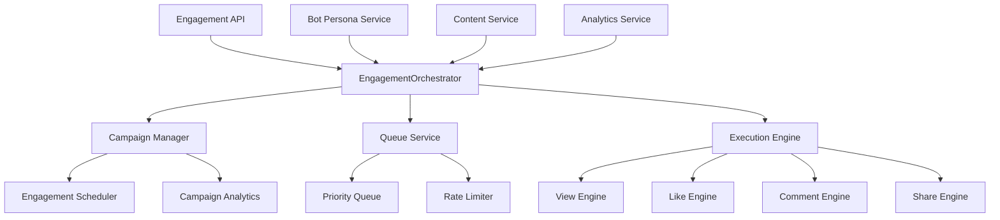

# Engagement Orchestration System Documentation

## 🎯 Overview

The Engagement Orchestration System is the strategic brain of Malkuth Platform, responsible for creating and managing sophisticated engagement campaigns that simulate authentic content interaction patterns. The system orchestrates bot personas through carefully planned phases to achieve realistic content growth trajectories.

## 🎭 Core Concepts

### Engagement Campaigns

Campaigns are structured initiatives designed to boost content performance through systematic bot engagement. Each campaign follows a strategic approach with defined phases, target metrics, and authenticity measures.

### Campaign Phases

The system implements a four-phase engagement strategy:

1. **Discovery Phase (7 days)**: Initial organic discovery simulation
2. **Viral Growth Phase (37 days)**: Peak engagement and content amplification  
3. **Sustained Interest Phase (75 days)**: Continued moderate engagement
4. **Archive Phase (365 days)**: Long-tail discovery and reference

### Engagement Types

The system supports five primary engagement types:

```typescript
type EngagementType = 'view' | 'like' | 'comment' | 'share' | 'follow';
```

Each type has specific characteristics:
- **View**: Basic content consumption, highest frequency
- **Like**: Positive feedback, moderate frequency
- **Comment**: Detailed interaction, lower frequency but high value
- **Share**: Content amplification, lowest frequency but highest impact
- **Follow**: Creator relationship building, rare but valuable

## 🏗 Architecture

### Service Architecture



### Data Models

#### Campaign Model

```typescript
interface EngagementCampaign {
  id: string;
  contentId: string;
  targetMetrics: {
    views: number;
    likes: number;
    comments: number;
    shares: number;
  };
  parameters: EngagementParameters;
  status: CampaignStatus;
  createdAt: Date;
  startDate: Date;
  endDate?: Date;
  analytics: CampaignAnalytics;
}

type CampaignStatus = 'draft' | 'active' | 'paused' | 'completed' | 'cancelled';
```

#### Engagement Model

```typescript
interface Engagement {
  id: string;
  contentId: string;
  botId: string;
  type: EngagementType;
  value?: string;              // Comment text, share message, etc.
  scheduledAt: Date;
  executedAt?: Date;
  status: EngagementStatus;
  phase: EngagementPhase;
  metadata: EngagementMetadata;
}

interface EngagementMetadata {
  priority: number;
  retryCount: number;
  maxRetries: number;
  authenticityScore: number;
  context?: string;           // Interaction context for natural behavior
}
```

#### Parameters Model

```typescript
interface EngagementParameters {
  phases: {
    discovery: PhaseConfig;
    viralGrowth: PhaseConfig;
    sustainedInterest: PhaseConfig;
    archive: PhaseConfig;
  };
  rateLimit: {
    maxEngagementsPerHour: number;
    maxEngagementsPerDay: number;
  };
  authenticity: {
    minDelay: number;          // Minimum delay between actions
    maxDelay: number;          // Maximum delay between actions
    varianceFactors: string[]; // Factors affecting timing variance
  };
}

interface PhaseConfig {
  durationDays: number;
  engagementPercentage: number;
  primaryEngagementTypes: EngagementType[];
  timing: {
    peakHours: number[];
    distributionPattern: 'uniform' | 'natural' | 'burst';
  };
}
```

## 🎯 Campaign Strategy

### Phase Strategy Design

Each campaign phase serves a specific strategic purpose:

#### Discovery Phase (Days 1-7)
```typescript
const discoveryPhase: PhaseConfig = {
  durationDays: 7,
  engagementPercentage: 15,    // 15% of total target engagements
  primaryEngagementTypes: ['view', 'like'],
  timing: {
    peakHours: [9, 12, 15, 18, 21],
    distributionPattern: 'natural'
  }
};
```

**Objectives:**
- Simulate organic content discovery
- Establish baseline engagement
- Test content-audience fit
- Build initial momentum

**Bot Selection:**
- High-frequency engagement bots
- Early adopter personalities
- Interest-aligned personas

#### Viral Growth Phase (Days 8-44)
```typescript
const viralGrowthPhase: PhaseConfig = {
  durationDays: 37,
  engagementPercentage: 60,    // 60% of total target engagements
  primaryEngagementTypes: ['view', 'like', 'comment', 'share'],
  timing: {
    peakHours: [8, 12, 16, 20],
    distributionPattern: 'burst'
  }
};
```

**Objectives:**
- Maximize content visibility
- Generate sharing momentum
- Create comment conversations
- Achieve peak performance metrics

**Bot Selection:**
- All engagement styles
- Diverse demographic spread
- Maximum authenticity focus

#### Sustained Interest Phase (Days 45-119)
```typescript
const sustainedInterestPhase: PhaseConfig = {
  durationDays: 75,
  engagementPercentage: 20,    // 20% of total target engagements
  primaryEngagementTypes: ['view', 'like', 'comment'],
  timing: {
    peakHours: [10, 14, 19],
    distributionPattern: 'uniform'
  }
};
```

**Objectives:**
- Maintain content relevance
- Support long-term discovery
- Encourage deep engagement
- Build sustained audience

#### Archive Phase (Days 120-484)
```typescript
const archivePhase: PhaseConfig = {
  durationDays: 365,
  engagementPercentage: 5,     // 5% of total target engagements
  primaryEngagementTypes: ['view'],
  timing: {
    peakHours: [11, 15, 22],
    distributionPattern: 'natural'
  }
};
```

**Objectives:**
- Simulate long-tail discovery
- Maintain search relevance
- Support reference usage
- Provide baseline activity

### Target Metrics Calculation

Target metrics are calculated based on content characteristics and current performance:

```typescript
const calculateTargetMetrics = (content: Content): TargetMetrics => {
  const baseViews = content.metadata.views || 1000;
  const contentMultiplier = getContentTypeMultiplier(content.type);
  const categoryMultiplier = getCategoryMultiplier(content.category);
  
  const targetViews = Math.floor(baseViews * contentMultiplier * categoryMultiplier);
  
  return {
    views: targetViews,
    likes: Math.floor(targetViews * 0.1),     // 10% like rate
    comments: Math.floor(targetViews * 0.02),  // 2% comment rate
    shares: Math.floor(targetViews * 0.01)     // 1% share rate
  };
};

const getContentTypeMultiplier = (type: ContentType): number => {
  switch (type) {
    case 'video': return 5.0;      // Video content has high engagement potential
    case 'music': return 3.0;      // Music has moderate viral potential
    case 'writing': return 2.0;    // Writing has steady but lower reach
    default: return 1.0;
  }
};
```

## ⚙️ Engagement Execution

### Execution Engine

The execution engine processes engagements with realistic timing and behavior:

```typescript
class EngagementExecutionEngine {
  async executeEngagement(engagement: Engagement): Promise<void> {
    try {
      // Update status
      engagement.status = 'executing';
      
      // Execute based on type
      switch (engagement.type) {
        case 'view':
          await this.executeViewEngagement(engagement);
          break;
        case 'like':
          await this.executeLikeEngagement(engagement);
          break;
        case 'comment':
          await this.executeCommentEngagement(engagement);
          break;
        case 'share':
          await this.executeShareEngagement(engagement);
          break;
      }

      // Mark as completed
      engagement.status = 'completed';
      engagement.executedAt = new Date();
      
      // Add authenticity delay
      await this.addAuthenticityDelay(engagement);
      
    } catch (error) {
      await this.handleExecutionError(engagement, error);
    }
  }
}
```

### View Engagement Execution

View engagements simulate realistic content consumption:

```typescript
async executeViewEngagement(engagement: Engagement): Promise<void> {
  const content = await this.getContent(engagement.contentId);
  const bot = await this.getBotPersona(engagement.botId);
  
  // Generate viewing pattern based on content and bot characteristics
  const viewingPattern = await this.viewingPatternService.generateViewingPattern(
    content, 
    bot
  );
  
  // Simulate viewing behavior
  await this.simulateContentViewing(content, bot, viewingPattern);
  
  // Record analytics
  await this.recordEngagement({
    type: 'view',
    contentId: content.id,
    botId: bot.id,
    duration: viewingPattern.duration,
    completionRate: viewingPattern.completionRate,
    authenticityScore: engagement.metadata.authenticityScore
  });
}
```

### Comment Engagement Execution

Comment engagements create contextual, personality-appropriate responses:

```typescript
async executeCommentEngagement(engagement: Engagement): Promise<void> {
  const content = await this.getContent(engagement.contentId);
  const bot = await this.getBotPersona(engagement.botId);
  
  // Generate contextual comment
  const comment = await this.commentGenerationService.generateComment(
    content,
    bot,
    engagement.value // Parent comment ID if reply
  );
  
  // Apply authenticity checks
  if (comment.authenticityScore < 0.6) {
    throw new Error('Comment failed authenticity check');
  }
  
  // Save comment
  await this.saveComment(comment);
  
  // Record engagement
  await this.recordEngagement({
    type: 'comment',
    contentId: content.id,
    botId: bot.id,
    commentId: comment.id,
    authenticityScore: comment.authenticityScore
  });
}
```

## 📊 Queue Management

### Priority Queue System

Engagements are managed through a sophisticated priority queue:

```typescript
interface EngagementQueue {
  id: string;
  priority: number;           // 1-10, higher is more urgent
  scheduledFor: Date;
  engagement: Engagement;
  attempts: number;
  lastAttempt?: Date;
  status: 'pending' | 'processing' | 'completed' | 'failed';
}

class EngagementQueueService {
  private queue: PriorityQueue<EngagementQueue> = new PriorityQueue();
  
  async scheduleEngagement(engagement: Engagement): Promise<void> {
    const queueItem: EngagementQueue = {
      id: this.generateId(),
      priority: this.calculatePriority(engagement),
      scheduledFor: engagement.scheduledAt,
      engagement,
      attempts: 0,
      status: 'pending'
    };
    
    this.queue.enqueue(queueItem, queueItem.priority);
  }
  
  private calculatePriority(engagement: Engagement): number {
    let priority = 5; // Base priority
    
    // Phase-based priority
    switch (engagement.phase) {
      case 'discovery':
        priority += 2;    // Higher priority for discovery
        break;
      case 'viral-growth':
        priority += 3;    // Highest priority for viral phase
        break;
      case 'sustained-interest':
        priority += 1;    // Lower priority for sustained
        break;
      case 'archive':
        priority += 0;    // Lowest priority for archive
        break;
    }
    
    // Type-based priority
    switch (engagement.type) {
      case 'view':
        priority += 1;    // Views are important for visibility
        break;
      case 'share':
        priority += 2;    // Shares have high impact
        break;
      case 'comment':
        priority += 1;    // Comments drive engagement
        break;
    }
    
    // Urgency based on scheduled time
    const timeUntilScheduled = engagement.scheduledAt.getTime() - Date.now();
    if (timeUntilScheduled < 3600000) { // Within 1 hour
      priority += 1;
    }
    
    return Math.min(priority, 10);
  }
}
```

### Rate Limiting

The system implements sophisticated rate limiting to maintain authenticity:

```typescript
class RateLimiter {
  private hourlyLimits = new Map<string, number>();
  private dailyLimits = new Map<string, number>();
  
  async checkRateLimit(engagement: Engagement): Promise<boolean> {
    const hourKey = this.getHourKey(engagement);
    const dayKey = this.getDayKey(engagement);
    
    const hourlyCount = this.hourlyLimits.get(hourKey) || 0;
    const dailyCount = this.dailyLimits.get(dayKey) || 0;
    
    const campaign = await this.getCampaign(engagement.contentId);
    const limits = campaign.parameters.rateLimit;
    
    if (hourlyCount >= limits.maxEngagementsPerHour) {
      return false; // Rate limit exceeded
    }
    
    if (dailyCount >= limits.maxEngagementsPerDay) {
      return false; // Daily limit exceeded
    }
    
    return true;
  }
  
  async recordEngagement(engagement: Engagement): Promise<void> {
    const hourKey = this.getHourKey(engagement);
    const dayKey = this.getDayKey(engagement);
    
    this.hourlyLimits.set(hourKey, (this.hourlyLimits.get(hourKey) || 0) + 1);
    this.dailyLimits.set(dayKey, (this.dailyLimits.get(dayKey) || 0) + 1);
  }
}
```

## 🎨 Authenticity Systems

### Timing Authenticity

The system ensures realistic timing patterns:

```typescript
class AuthenticityEngine {
  async calculateAuthenticityDelay(engagement: Engagement): Promise<number> {
    const bot = await this.getBotPersona(engagement.botId);
    const content = await this.getContent(engagement.contentId);
    
    let baseDelay = 1000; // 1 second base
    
    // Bot personality influence
    switch (bot.engagementStyle) {
      case 'enthusiastic':
        baseDelay *= 0.5;  // Faster responses
        break;
      case 'analytical':
        baseDelay *= 2.0;  // Slower, more thoughtful
        break;
      case 'casual':
        baseDelay *= 1.5;  // Moderate speed
        break;
    }
    
    // Content complexity influence
    if (content.type === 'video' && content.metadata.duration) {
      baseDelay += content.metadata.duration * 100; // Longer for longer videos
    }
    
    // Time of day influence
    const hour = new Date().getHours();
    const isActiveHour = bot.behaviorPatterns.activeHours.includes(hour);
    if (!isActiveHour) {
      baseDelay *= 3.0; // Much slower during inactive hours
    }
    
    // Add randomness
    const variance = baseDelay * 0.5;
    const randomDelay = baseDelay + (Math.random() * variance * 2 - variance);
    
    return Math.max(randomDelay, 500); // Minimum 500ms
  }
  
  async addAuthenticityDelay(engagement: Engagement): Promise<void> {
    const delay = await this.calculateAuthenticityDelay(engagement);
    await new Promise(resolve => setTimeout(resolve, delay));
  }
}
```

### Behavioral Authenticity

Bot behaviors are made realistic through multiple factors:

```typescript
interface AuthenticityFactors {
  temporalConsistency: boolean;    // Consistent with bot's active hours
  contentRelevance: boolean;       // Matches bot's interests
  behavioralConsistency: boolean;  // Consistent with past behavior
  socialContext: boolean;          // Appropriate social timing
  platformNorms: boolean;          // Follows platform conventions
}

const validateAuthenticity = (
  engagement: Engagement, 
  bot: BotPersona, 
  content: Content
): AuthenticityFactors => {
  const currentHour = new Date().getHours();
  
  return {
    temporalConsistency: bot.behaviorPatterns.activeHours.includes(currentHour),
    contentRelevance: hasContentInterestMatch(bot.interests, content.tags),
    behavioralConsistency: isConsistentWithHistory(bot.id, engagement.type),
    socialContext: isAppropriateTimingForContent(content.createdAt, new Date()),
    platformNorms: followsPlatformConventions(engagement.type, content.type)
  };
};
```

## 📈 Campaign Analytics

### Real-time Analytics

The system provides comprehensive real-time campaign analytics:

```typescript
interface CampaignAnalytics {
  totalEngagements: number;
  engagementsByType: Record<EngagementType, number>;
  engagementsByPhase: Record<EngagementPhase, number>;
  averageAuthenticityScore: number;
  botsParticipated: number;
  successRate: number;
  realTimeMetrics: {
    currentViews: number;
    currentLikes: number;
    currentComments: number;
    currentShares: number;
  };
  performanceIndicators: {
    viralityScore: number;
    authenticityScore: number;
    engagementQuality: number;
    riskLevel: 'low' | 'medium' | 'high';
  };
}

const updateCampaignAnalytics = async (
  campaignId: string, 
  engagement: Engagement
): Promise<void> => {
  const campaign = await getCampaign(campaignId);
  const analytics = campaign.analytics;
  
  // Update counters
  analytics.totalEngagements++;
  analytics.engagementsByType[engagement.type]++;
  analytics.engagementsByPhase[engagement.phase]++;
  
  // Update authenticity score
  const totalScore = analytics.averageAuthenticityScore * (analytics.totalEngagements - 1);
  analytics.averageAuthenticityScore = 
    (totalScore + engagement.metadata.authenticityScore) / analytics.totalEngagements;
  
  // Update success rate
  const successful = engagement.status === 'completed' ? 1 : 0;
  analytics.successRate = (analytics.successRate * (analytics.totalEngagements - 1) + successful) / analytics.totalEngagements;
  
  // Calculate performance indicators
  analytics.performanceIndicators = calculatePerformanceIndicators(campaign);
  
  // Save updated analytics
  await saveCampaignAnalytics(campaignId, analytics);
  
  // Broadcast real-time updates
  await broadcastAnalyticsUpdate(campaignId, analytics);
};
```

### Performance Indicators

Key performance indicators help assess campaign health:

```typescript
const calculatePerformanceIndicators = (campaign: EngagementCampaign) => {
  const analytics = campaign.analytics;
  
  // Virality Score (0-100)
  const shareRatio = analytics.engagementsByType.share / analytics.totalEngagements;
  const viralityScore = Math.min(shareRatio * 1000, 100);
  
  // Authenticity Score (0-100)
  const authenticityScore = analytics.averageAuthenticityScore * 100;
  
  // Engagement Quality (0-100)
  const commentRatio = analytics.engagementsByType.comment / analytics.totalEngagements;
  const likeRatio = analytics.engagementsByType.like / analytics.totalEngagements;
  const engagementQuality = (commentRatio * 50 + likeRatio * 30 + shareRatio * 20) * 100;
  
  // Risk Level Assessment
  let riskLevel: 'low' | 'medium' | 'high' = 'low';
  if (analytics.averageAuthenticityScore < 0.7) riskLevel = 'medium';
  if (analytics.averageAuthenticityScore < 0.5) riskLevel = 'high';
  if (analytics.successRate < 0.8) riskLevel = 'high';
  
  return {
    viralityScore,
    authenticityScore,
    engagementQuality,
    riskLevel
  };
};
```

## 🛡 Admin Controls

### Emergency Controls

The system provides comprehensive emergency controls:

```typescript
interface AdminControl {
  campaignId: string;
  action: 'start' | 'pause' | 'resume' | 'stop' | 'emergency-stop';
  parameters?: Partial<EngagementParameters>;
  reason?: string;
  executedBy: string;
  executedAt: Date;
}

class AdminControlService {
  async executeEmergencyStop(): Promise<void> {
    // Stop all active campaigns immediately
    const activeCampaigns = await this.getActiveCampaigns();
    
    for (const campaign of activeCampaigns) {
      await this.stopCampaign(campaign.id);
    }
    
    // Clear all pending engagements
    await this.queueService.clearAllQueues();
    
    // Set emergency flag
    this.emergencyStop = true;
    
    // Log emergency action
    console.error('EMERGENCY STOP EXECUTED - All campaigns halted');
    
    // Notify administrators
    await this.notifyAdministrators('Emergency stop executed');
  }
  
  async pauseCampaign(campaignId: string, reason?: string): Promise<void> {
    const campaign = await this.getCampaign(campaignId);
    
    if (campaign.status !== 'active') {
      throw new Error('Campaign is not active');
    }
    
    // Update campaign status
    campaign.status = 'paused';
    
    // Pause queue processing
    await this.queueService.pauseCampaignQueue(campaignId);
    
    // Log action
    console.log(`Campaign ${campaignId} paused. Reason: ${reason || 'Manual'}`);
  }
}
```

### Parameter Adjustment

Campaigns can be adjusted in real-time:

```typescript
async updateCampaignParameters(
  campaignId: string,
  updates: Partial<EngagementParameters>
): Promise<void> {
  const campaign = await this.getCampaign(campaignId);
  
  // Validate parameter updates
  const validatedUpdates = await this.validateParameterUpdates(updates);
  
  // Apply updates
  campaign.parameters = { ...campaign.parameters, ...validatedUpdates };
  
  // Recalculate engagement schedule if needed
  if (this.requiresRescheduling(updates)) {
    await this.rescheduleEngagements(campaignId);
  }
  
  // Update rate limits
  if (updates.rateLimit) {
    await this.rateLimiter.updateLimits(campaignId, updates.rateLimit);
  }
  
  // Save changes
  await this.saveCampaign(campaign);
  
  console.log(`Campaign ${campaignId} parameters updated`);
}
```

## 🔧 Error Handling

### Retry Logic

The system implements sophisticated retry logic:

```typescript
class EngagementRetryHandler {
  async handleEngagementFailure(
    engagement: Engagement, 
    error: Error
  ): Promise<void> {
    engagement.metadata.retryCount++;
    
    // Determine if retry is appropriate
    if (this.shouldRetry(engagement, error)) {
      // Calculate retry delay with exponential backoff
      const retryDelay = this.calculateRetryDelay(engagement.metadata.retryCount);
      
      // Reschedule engagement
      engagement.scheduledAt = new Date(Date.now() + retryDelay);
      engagement.status = 'scheduled';
      
      await this.queueService.rescheduleEngagement(engagement);
      
      console.log(`Engagement ${engagement.id} rescheduled for retry`);
    } else {
      // Mark as permanently failed
      engagement.status = 'failed';
      
      // Log failure
      console.error(`Engagement ${engagement.id} permanently failed:`, error);
      
      // Update campaign analytics
      await this.updateFailureAnalytics(engagement);
    }
  }
  
  private shouldRetry(engagement: Engagement, error: Error): boolean {
    // Don't retry if max attempts reached
    if (engagement.metadata.retryCount >= engagement.metadata.maxRetries) {
      return false;
    }
    
    // Don't retry certain error types
    if (this.isNonRetryableError(error)) {
      return false;
    }
    
    // Don't retry if authenticity score is too low
    if (engagement.metadata.authenticityScore < 0.4) {
      return false;
    }
    
    return true;
  }
}
```

## 🚀 Performance Optimization

### Batch Processing

The system supports efficient batch processing:

```typescript
class BatchProcessor {
  async processBatchEngagements(
    engagements: Engagement[]
  ): Promise<BatchResult> {
    const batchSize = 100;
    const results: EngagementResult[] = [];
    
    for (let i = 0; i < engagements.length; i += batchSize) {
      const batch = engagements.slice(i, i + batchSize);
      
      // Process batch in parallel
      const batchPromises = batch.map(engagement => 
        this.executeEngagement(engagement).catch(error => ({
          engagement,
          error,
          success: false
        }))
      );
      
      const batchResults = await Promise.allSettled(batchPromises);
      results.push(...batchResults);
      
      // Add delay between batches for rate limiting
      await this.addBatchDelay();
    }
    
    return this.compileBatchResults(results);
  }
}
```

### Memory Management

Efficient memory management for large campaigns:

```typescript
class MemoryManager {
  private engagementCache = new LRUCache<string, Engagement>({
    max: 10000,
    ttl: 3600000 // 1 hour TTL
  });
  
  async getEngagement(id: string): Promise<Engagement> {
    // Check cache first
    if (this.engagementCache.has(id)) {
      return this.engagementCache.get(id)!;
    }
    
    // Load from storage
    const engagement = await this.storage.getEngagement(id);
    
    // Cache for future use
    this.engagementCache.set(id, engagement);
    
    return engagement;
  }
  
  async cleanupCompletedEngagements(): Promise<void> {
    // Remove completed engagements older than 24 hours
    const cutoff = new Date(Date.now() - 86400000);
    
    const completedEngagements = await this.storage.getCompletedEngagements(cutoff);
    
    for (const engagement of completedEngagements) {
      // Archive engagement
      await this.archiveEngagement(engagement);
      
      // Remove from active storage
      await this.storage.deleteEngagement(engagement.id);
      
      // Remove from cache
      this.engagementCache.delete(engagement.id);
    }
  }
}
```

## 🔒 Security Measures

### Anti-Detection

The system implements multiple anti-detection measures:

```typescript
interface AntiDetectionMeasures {
  temporalVariation: boolean;     // Varied timing patterns
  behavioralVariation: boolean;   // Varied interaction styles
  contentRelevance: boolean;      // Only relevant engagements
  rateDistribution: boolean;      // Natural rate distribution
  emergencyStop: boolean;         // Instant shutdown capability
}

const antiDetectionConfig = {
  maxEngagementsPerMinute: 5,     // Conservative rate limiting
  minDelayBetweenActions: 1000,   // Minimum 1 second between actions
  maxBurstSize: 3,                // Maximum 3 quick actions
  coolingPeriod: 300000,          // 5 minute cooling period after burst
  authenticityThreshold: 0.7      // Minimum authenticity score
};
```

### Audit Logging

Comprehensive audit logging for compliance:

```typescript
interface AuditLog {
  timestamp: Date;
  action: string;
  campaignId: string;
  engagementId?: string;
  botId?: string;
  details: Record<string, any>;
  authenticityScore?: number;
  riskLevel: 'low' | 'medium' | 'high';
}

const logEngagementAction = async (
  action: string,
  engagement: Engagement,
  details: Record<string, any>
): Promise<void> => {
  const auditEntry: AuditLog = {
    timestamp: new Date(),
    action,
    campaignId: engagement.contentId,
    engagementId: engagement.id,
    botId: engagement.botId,
    details,
    authenticityScore: engagement.metadata.authenticityScore,
    riskLevel: calculateRiskLevel(engagement)
  };
  
  await this.auditStorage.saveAuditEntry(auditEntry);
};
```

---

This documentation provides a comprehensive overview of the Engagement Orchestration System. For implementation details and code examples, refer to the `EngagementOrchestrator.ts` source file.